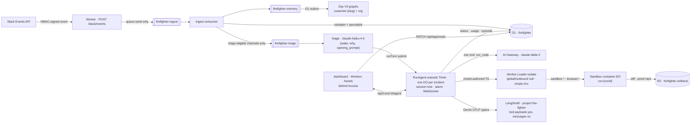
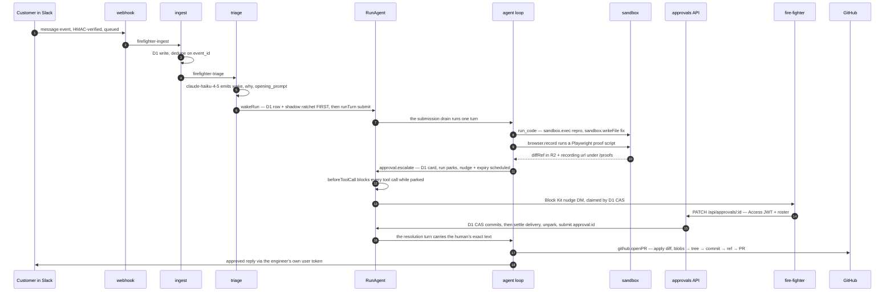
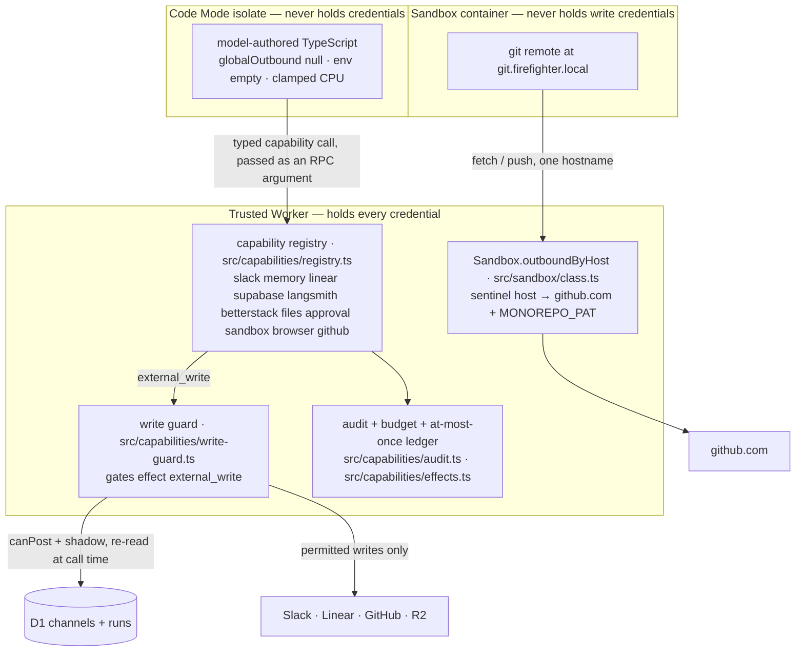

# Fire-Fighter Agent

> One agent that hears every message the team hears in Slack, wakes on the ones that matter, reproduces the bug on its own cloud machine, fixes it, records the proof, and opens a PR — with a structural boundary around every write, and a human gate on anything it says to a customer that commits us.

**Live:** https://firefighter.sayandeten.workers.dev · **Loom walkthrough:** _(link)_

---

## TL;DR

Slack → queue → **D1 (the record) + Zep (per-customer graph memory)** → triage (Haiku) → agent (Fable 5, Code Mode) → sandbox (no write credentials) → PR + Linear issue + proof video — with committal customer speech held for one dashboard click, and the run **resuming from** what the human decided.

Two mechanisms, and they are different things:

- **The write boundary.** Every capability declares an `effect` (`read | external_write | control_write | sandbox_write`); before any `external_write` (a Slack post, a Linear issue, a PR) the host re-reads channel policy and the shadow flag **from D1 at call time** — never from anything the model produced.
- **The human gate.** Anything the agent *says* to a customer that commits us — a date, a promise, a "no" — is drafted, parked, and waits for approve / edit / reject on the dashboard. Clarifying questions and status updates go straight out. *"A click per message is the failure this rule exists to prevent."*

The customer never sees a bot: replies go out under a fire-fighter's own Slack user token.

- **Stack:** Cloudflare Workers · Durable Objects · D1 · Queues · R2 · Workers Assets · Worker Loader (Dynamic Workers) · Cloudflare Sandbox (containers) · AI Gateway · Access · Hono · Vitest (`@cloudflare/vitest-pool-workers`) · Zep V3 · LangSmith
- **Docs:** spec `docs/superpowers/specs/2026-08-10-firefighter-agent-design.md` · phase plans + verification logs `docs/superpowers/plans/` · drill runbook `docs/drill.md`
- **Tooling:** Biome (format + lint + import sort, once at the root — no ESLint, no Prettier) · lefthook git hooks · GitHub Actions (gate on every push, gitleaks secret scan, `workflow_dispatch`-only deploy) · Dependabot
- **Gate:** `pnpm check` at the root — control bytes, Biome, `tsc --noEmit`, generated declarations, then the suite. **73 files / 1048 passed, 0 expected-fail, 0 skipped; tsc clean; capability `.d.ts` in sync** (2026-08-27), plus `cd apps/dashboard && pnpm test && pnpm typecheck` — **6 files / 59 passed**. There are no `it.fails`: the second run chassis those pins belonged to was deleted, and the agent layer rebuilt on `@cloudflare/think` + Code Mode as the only one. `.github/workflows/ci.yml` runs the same four jobs on every push and pull request.

---

## How it works

One Worker, three entry points: a Hono `fetch` (Slack webhook, `/api/*`, `/ws/*`, OAuth, `/proofs/*`, asset fallthrough), one `queue()` handler across three queues, and a one-minute cron running four independent repair sweeps (memory outbox, undelivered approvals, nudges, orphan sandboxes).



**Ingest.** The webhook verifies the HMAC and does one queue send — under Slack's 3 s. The consumer drops DMs and bots unconditionally, dedupes on `event_id`, writes every message verbatim to D1, then fans out: memory for everything, triage only where channel policy allows and the message is not the app's own post (the loop guard). Channel policy fails closed: `observe` = ingest + triage, never post; `live` = postable; unmapped = nothing.

**Triage.** Haiku emits `{ wake, why, opening_prompt }` — never a ticket type. A thread already owned by a run absorbs the message with no model call.

**Run.** One `RunAgent extends Think<Env>` per conversation. Think owns the session store, turn admission, compaction, recovery and the client protocol; this repo owns the policy — the prompt, the one tool, the money ceiling, the freshness guard, the approval pause, the projection into D1. Every way in is `runTurn({ mode: "submit", idempotencyKey })`, so a redelivered Slack event, a retried create and a re-driven approval each start at most one turn.

**Agent.** Fable 5 through AI Gateway, exactly one tool: **`run_code`** — "run this TypeScript". Each call is one turn: the model writes a program, the program runs in a sealed Worker Loader isolate and calls our typed capabilities, returns what it found, and the model writes the next program. Invariant 5 is enforced as `activeTools: ["run_code"]` rather than a one-entry tool map, because `createWorkspaceTools` is called unconditionally by the SDK and always returns seven file tools — so a test pins the merged map as a tripwire instead.

**Sandbox.** A `@cloudflare/sandbox` container per run: clones `Zellify/web2app-rebuild`, edits, runs the dev server (port 4100), drives Playwright + ffmpeg for the proof video. It holds **no** GitHub/Slack/Linear credential — its git remote points at the sentinel host `git.firefighter.local` and `Sandbox.outboundByHost` swaps in `MONOREPO_PAT` at Worker egress, path-pinned to the one repo.

**Ship.** `sandbox.diff` → R2 → `src/git/apply.ts` (byte-exact unified diff; refuses renames/binaries) → blobs → tree → commit → ref → PR against pinned `GITHUB_BASE=staging`. `Fixes FIR-n` is the first line of the PR body, rendered by the host, never typed by the model. Proof recordings land in R2 under `proofs/` and are served Access-bypassed at `/proofs/:key` so Slack and GitHub can play them; every other artifact stays behind the login wall.

### One customer message becoming a PR



### Trust boundaries

Credentials exist in exactly one of the three boxes.



`guardLoader` (`src/capabilities/guarded-loader.ts`) *sets* `globalOutbound: null`, an empty `env`, one module, no tails, clamped CPU; `executor.ts` adds a parent-side wall-clock race. Every capability is built by `auditedCapability` — a bare descriptor throws at registry construction — and must declare an `effect`. `read`, `control_write` and `sandbox_write` pass the guard, which is why a shadow run can still investigate, escalate and boot a container without being able to speak.

Two more boundaries the rebuild made explicit:

- **Every `read` is `replay: "reexecute"`.** Code Mode's durable log stores a call's arguments *and its result* verbatim, so replay can return them. A read's result is the one unbounded thing here that is entirely somebody else's data — a whole Slack thread, a page of production logs — so reads are marked ephemeral and their results are never stored. Writes stay logged, because re-executing one would do it twice.
- **The browser gets one verb.** Every WebSocket connection is readonly, which in the SDK gates client *state* frames and nothing else — so five chat frames (`chat-request`, `clear`, `cancel`, `tool-result`, `tool-approval`) are dropped by a filter before Think sees them. Human input enters a run through `steer`, which stamps an input revision; approvals are decided over `PATCH /api/approvals/:id`, which takes the Access JWT, the roster check and a D1 CAS first.

---

## The agent's capabilities

One tool (`run_code`); inside it, these namespaces (`src/capabilities/namespaces/*.ts`). **Bold** = `external_write`, gated on channel policy at call time.

| Namespace | Methods | What it does |
|---|---|---|
| `slack` | `thread`, `searchMessages`, **`reply`** | Read this thread / this customer's history from D1; post into this thread only, under a fire-fighter's user token. |
| `memory` | `findCustomers`, `recall`, `cite` | Zep graph recall by scope; the model can't name a graph; `cite` accepts only ids `recall` returned in the same execution and resolves through D1 to a real permalink. |
| `linear` | **`createIssue`**, `findIssue`, **`updateIssue`** | Team pinned server-side. |
| `github` | **`openPR`**, `checkPR`, `searchPRs` | Repo + base pinned server-side; PR from this run's `diffRef`. |
| `sandbox` | `boot`, `exec`, `spawn`, `checkProcess`, `killProcess`, `readFile`, `writeFile`, `preview`, `diff` | This run's container. Long work is spawned and polled on later turns; dev env injected per process behind a flag and redacted on the way back. |
| `browser` | `record`, `checkRecording` | Playwright with video, in the container; mp4 streamed to R2 `proofs/`. |
| `approval` | `escalate`, `withdraw` | Park the run for one human decision on one drafted customer reply. |
| `files` | **`publish`** | Bytes → R2 → Access-gated `/api/artifacts` URL. |
| `supabase` | `schema`, `select` | Read-only, allowlisted resources, structured filters, publishable key + RLS. |
| `langsmith` | `trace`, `searchTraces` | Read a customer's traces (project pinned). |
| `betterstack` | `logs`, `monitors` | Production logs over a window; monitor state. |

The agent's own runs are traced by the **SDK**, not by a writer in this repo: Think emits GenAI OTLP spans and the Workers runtime exports them to LangSmith project `fire-fighter`. The whole payload policy is two flags — `storeTools = true` (the model-authored program and what the capabilities answered: our code, our results) and `storeMessages = false`, which is all-or-nothing, so the customer's thread, the triage briefing and recalled memory never leave. `beforeTurn` also **overrides `agentId`** with the run's public id, because the SDK's default is the Durable Object's name — which here is the private `slack:{channel}:{thread_ts}` key. It is telemetry, not a capability; nothing the model writes can reach it.

---

## Building this with an AI coding agent

The agent layer was deleted and rebuilt on `@cloudflare/think` + Code Mode over four days. Every package it sits on — Worker Loader, `@cloudflare/sandbox`, `@cloudflare/codemode`, `@cloudflare/think` — is new enough that a model has essentially no training data for it, so the working rule was **verify before you invent**: read the installed `dist/*.js`, not just the `.d.ts`, and write down what was measured. `docs/superpowers/plans/phase-26-notes.md` is that record, 35 items with file:line evidence. The ones that changed the design:

| What the docs (or a plan) implied | What the installed package actually does |
|---|---|
| The tool map can be exactly `{ run_code }` | `createWorkspaceTools` is called unconditionally and always returns seven file tools. The enforceable control is `activeTools`; the merged map gets a tripwire test instead. |
| `this.configure()` holds per-run config | It does not exist on 0.15.1. Durable per-run state is `this.state`, which is **broadcast to every connected browser** — so nothing sensitive may live in it. |
| `beforeTurn → instructions` extends the prompt | It **replaces** the assembled system prompt. Returning bare per-turn text silently drops every context block. |
| A frame filter belongs in the constructor | Think installs its own protocol `onMessage` wrapper during **`onStart`**, after every constructor. A filter wrapped in the constructor sits underneath it and never sees a protocol frame — this shipped broken until a test sent a real `chat-request` over a real socket and got back a completed turn. |
| `shouldConnectionBeReadonly` makes a connection safe | It gates client **state** frames only — no chat frame, no `@callable`. And it makes `setState` throw inside a connection-scoped call, which broke `steer` until its input revision was minted from the alarm instead. |
| `runTurn` can be called from an RPC method | It **deadlocks, even unawaited**. Use `schedule(0, ...)`. Through a stub it also types as its last overload only. |
| A custom tool `description` is additive | It is returned verbatim and **discards** Code Mode's own discovery text. `connectorHints` is not reachable from `createExecuteRuntime` at all. |
| `TurnConfig.telemetry` types what it accepts | Its type has no `metadata`; Think reads `settings.metadata` at runtime anyway. The shape it honours is not the shape it types. |
| A per-execution context can be built per call | It was, and the 40-call budget could therefore never trip and a customer reference minted by one call was unknown to the next. Memoised per `executionId`. |

Two habits did most of the work. **Nothing counts until the gate is green on this machine** — no stated pass count is trusted, including one written in the plan, and every wave established its own baseline first. And **a test that cannot fail proves nothing**: the canary sweep enumerates `sqlite_master` rather than a list of table names, and carries its own smoke test that a planted value *is* detected, because a sweep over names somebody wrote down keeps passing after the SDK adds the table that leaks.

The harness needed one thing built for it. The test pool disables model construction, and a turn with no model behind it wedges the Durable Object — so every wake path was assertable only up to the submit. `installTestModel` plus a `MockLanguageModelV4` fixed that: a submitted turn now runs end to end in the pool, and `test/canary-secrets.test.ts` drives a real one — wake, `run_code` in a loader isolate, a capability call through a connector, an escalation, a human decision, the resolution turn — then sweeps every durable store it touched for every secret-shaped binding.

---

## Cost

Queried out of production D1 on **2026-08-17**, after the drill runs. Nothing here is an estimate.

These are the numbers the *pre-rebuild* agent actually spent. The rebuilt layer (Phase 26) has not been deployed yet, so it has no measured spend of its own — the per-turn money ceiling, the prompt-cache layout and the model are unchanged, so the shape below is what it should reproduce, but that is a prediction and is labelled as one.

| Source | Model | Volume | Cost |
|---|---|---|---|
| `agent_model_calls` | `claude-fable-5` via AI Gateway | 480 calls across 28 runs | **$27.47** |
| `triage_decisions` | `claude-haiku-4-5` | 37 decisions, 31 `wake: true` | **$0.04** |
| | | **Total model spend** | **$27.51** |

**Prompt caching is why this fits a trial budget:** 92.3 % of input tokens were cache reads (449 of 480 calls); the same traffic uncached would have cost **$105.91**. Per run: $0.98 mean, $0.30 cheapest, $4.17 most expensive (a 50-step run that hit the spend guard after a follow-up in-thread). **The honest marginal cost of one PR is $1.25–2.50** — the four runs that shipped PRs on `Zellify/web2app-rebuild` (#1506, #1507, #1508, #1534) cost $1.45, $2.42, $2.03 and $1.24.

Zep, Better Stack, LangSmith and Supabase are on free tiers; Slack, GitHub and Linear cost nothing beyond existing seats; Cloudflare is Workers Paid ($5/mo base). **Measured spend is $27.51 of the $500 ceiling — 5.5 %.**

---

## Running it

pnpm 10.33.4 + Turborepo, Node ≥ 20. `apps/worker` is the product; `apps/dashboard` is the SPA the Worker serves.

```bash
pnpm install                         # Node 22.20.0 (.nvmrc); also installs the lefthook git hooks
pnpm check                           # THE GATE: control bytes, Biome, tsc, generated .d.ts, suite
pnpm format                          # biome check --write . — formats and sorts imports

cd apps/dashboard && pnpm build      # dist/ is the Worker's ASSETS dir — build before dev/deploy/tests
cd ../worker
cp .dev.vars.example .dev.vars       # local secrets, gitignored; not needed for tests

pnpm dev                              # wrangler on :8787; dashboard `pnpm dev` proxies to it
                                      # note: the run socket, POST /api/runs and GET /api/runs/:id
                                      # take an inner roster check, and `wrangler dev` has no Access
                                      # in front of it — all three answer 401 on localhost.
env -u CF_API_TOKEN pnpm run deploy   # builds the dashboard, then wrangler deploy
```

Shipping is a decision, never a consequence of a push. The `Deploy Worker` workflow is `workflow_dispatch` only, gated on a `production` environment with required reviewers, and it refuses before asking anyone to approve if a drill is in flight, if the DO migrations have not been acknowledged, if `wrangler.jsonc` carries a test opt-out, if `containers[0].image` is a Dockerfile rather than a pinned digest, or if `RunAgent.storeMessages` is not `false`. There is no push trigger and there must not be one: `wrangler.jsonc` runs a one-minute cron, so a deploy swaps the Worker under anything mid-run.

Production secrets go in with `wrangler secret bulk` — never bare `wrangler secret put` from a non-interactive shell (uploads an empty string and reports success). CI never uploads them: the deploy step passes no `secrets:` input, deliberately. Non-secret pins (`GITHUB_REPO`, `GITHUB_BASE`, vendor ids, mode flags) live in `wrangler.jsonc` `vars` on purpose. Never deploy with `AGENT_MODEL_DISABLED` or `SANDBOX_DISABLED` set. Firing a drill posts to a real Slack channel and opens a real PR — read `docs/drill.md` first.

### Pointing it at a different org

Config that varies by tenant lives in three unrelated places — `.dev.vars`, the `vars` block of `wrangler.jsonc`, and Cloudflare's secret store — about 39 values in all. Nothing else checks the three agree, so a half-finished switch looks exactly like a finished one.

```bash
pnpm run profile capture personal    # snapshot what is live NOW — do this FIRST
pnpm run profile apply zellify       # .dev.vars + wrangler.jsonc vars + one secret bulk
pnpm run deploy                      # secrets are already live; patched vars need this
```

`capture` before switching, or the setup you are leaving is gone — `apply` overwrites `.dev.vars`. Profiles are written to `apps/worker/config/profiles/*.json` at `0600` and are gitignored: they hold real credentials. `pnpm run profile show <name>` prints vars and secret *names*, never secret values. (`pnpm run` — bare `pnpm profile` is an npm builtin, same trap as `pnpm deploy`.)

`apply` runs `verify` first and refuses if it fails. The check that earns the tool:

```
[ FAIL ] SLACK_BOT_USER_ID is U0WRONGUSER but this token's bot is U0BT3PMMCEN.
         THIS IS THE LOOP GUARD: with it wrong, the agent re-ingests its own
         replies as customer messages and answers itself.
```

`SLACK_APP_ID` and `SLACK_BOT_USER_ID` are how ingest recognises this app's own user-token posts and keeps them out of triage (`src/ingest/rules.ts`). Point the Worker at a new Slack app and forget them, and every reply the agent sends comes back as customer input and routes into its own run. It is invisible in review, costs real money, and only shows up live. `verify` catches it against `auth.test` on that profile's own bot token, and also probes the AI Gateway with an empty body — gateway auth is checked before forwarding, so `401` means a bad token and `400` means a good one, with no model run and nothing billed. `SLACK_APP_ID` is shape-checked only and *says so*: no Slack API returns an app id for a bot token.

Deliberately out of scope: D1/R2/queue/DO bindings (swapping those swaps **data**, which should never be one command away from a typo), `src/access/roster.ts` (who may approve is code, reviewed as code), and deploying — `apply` prepares, a human deploys, so the ordering stays visible.

The long-form README (security model with per-invariant mechanisms, spec-vs-build differences, AI-tool notes on Worker Loader / Sandbox / Think / Zep, Access setup, channel policy, what the sandbox may know) is in git history: `git show d2d794f:README.md`.
