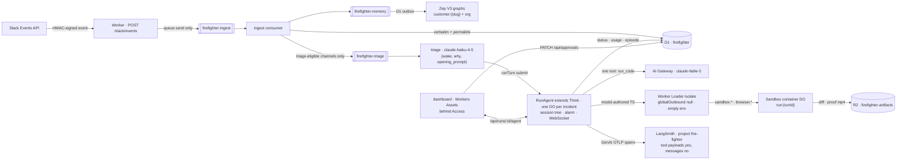
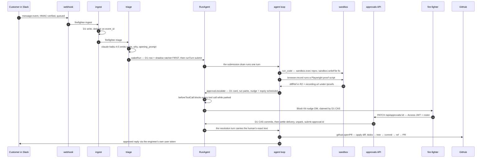
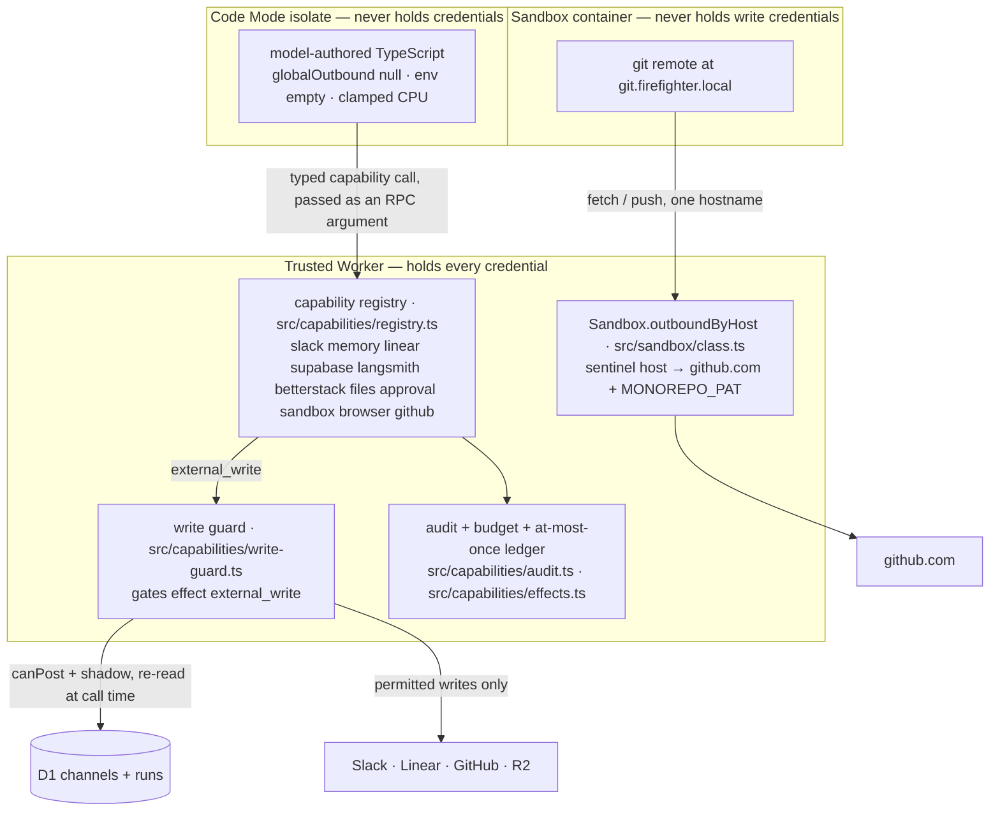

# Fire-Fighter Agent

> One agent that hears every Slack message the team hears, wakes on the ones that matter, reproduces the bug on its own cloud machine, fixes it, records the proof, and opens a PR.

**Live:** https://firefighter.sayandeten.workers.dev · **Loom walkthrough:** _(link)_

---

## TL;DR

Slack → queue → **D1 (the record) + Zep (per-customer graph memory)** → triage (Haiku) → agent (Fable 5, Code Mode) → sandbox (no write credentials) → PR + Linear issue + proof video.

Two mechanisms, and they are different things:

- **The write boundary.** Every capability declares an `effect` (`read | external_write | control_write | sandbox_write`). Before any `external_write`, the host re-reads channel policy and the shadow flag **from D1 at call time** — never from anything the model produced.
- **The human gate.** Anything the agent *says* that commits us — a date, a promise, a "no" — is drafted, parked, and waits for approve / edit / reject. Questions and status updates go straight out: a click per message is the failure this rule prevents.

Replies go out under a fire-fighter's own Slack user token. The customer never sees a bot.

- **Stack:** Workers · Durable Objects · D1 · Queues · R2 · Workers Assets · Worker Loader · Cloudflare Sandbox · AI Gateway · Access · Hono · Vitest · Zep V3 · LangSmith
- **Docs:** spec `docs/superpowers/specs/2026-08-10-firefighter-agent-design.md` · plans + verification logs `docs/superpowers/plans/` · drill runbook `docs/drill.md`
- **Tooling:** Biome (once at the root) · husky hooks · GitHub Actions (gitleaks, `workflow_dispatch`-only deploy) · Dependabot
- **Gate:** `pnpm check` — control bytes, Biome, `tsc`, generated `.d.ts`, suite. Worker **75 files / 1078 tests**, dashboard **6 / 59**. Nothing skipped, no `it.fails`. CI runs the same four jobs on every push and PR.

---

## How it works

One Worker, three entry points: a Hono `fetch` (Slack webhook, `/api/*`, `/ws/*`, OAuth, `/proofs/*`, assets), one `queue()` handler across three queues, and a one-minute cron running four repair sweeps.



| Stage | |
|---|---|
| **Ingest** | HMAC, then one queue send — inside Slack's 3 s. The consumer drops DMs and bots, dedupes on `event_id`, writes every message verbatim to D1, then fans out. The app's own posts are never re-triaged: that is the loop guard. |
| **Channels** | Self-registering — invite the bot and the first message registers the channel; a cron sweep catches silent ones. New channels default to `live` (invite is consent). Policy fails closed: `observe` = never post, unmapped = nothing. |
| **Tenant key** | `customer_slug` is derived from the channel name. Fine for picking a Zep graph; **not** fine as a Supabase tenant key, where a collision would return another customer's rows and look like a clean read. A derived slug refuses tenant-scoped reads until a human confirms it. |
| **Triage** | Haiku emits `{ wake, why, opening_prompt }` — never a ticket type. A thread already owned by a run absorbs the message with no model call. |
| **Run** | One `RunAgent extends Think<Env>` per conversation. Think owns the session store, turn admission, compaction and recovery; this repo owns the policy. Every way in is `runTurn({ mode: "submit", idempotencyKey })`, so redeliveries start at most one turn. |
| **Agent** | Fable 5 through AI Gateway, exactly one tool: **`run_code`**. The model writes a program, it runs in a sealed isolate and calls our typed capabilities, and the model writes the next one. |
| **Sandbox** | A container per run: clones the monorepo, edits, runs the dev server, drives Playwright + ffmpeg for the proof video. It holds **no** write credential — git points at `git.firefighter.local` and the Worker swaps in `MONOREPO_PAT` at egress. |
| **Ship** | `sandbox.diff` → R2 → byte-exact diff apply (refuses renames and binaries) → blobs → tree → commit → ref → PR against pinned `staging`. Proofs are Access-bypassed at `/proofs/:key` so Slack and GitHub can play them; every other artifact stays gated. |

### One customer message becoming a PR



### Trust boundaries

Credentials exist in exactly one of the three boxes.



- **The isolate is sealed by construction** — `globalOutbound: null`, empty `env`, one module, no tails, clamped CPU, plus a parent-side wall-clock race.
- **Effects are mandatory.** A bare descriptor throws at registry construction. `read`, `control_write` and `sandbox_write` pass the guard, so a shadow run can investigate, escalate and boot a container without being able to speak.
- **Every `read` is `replay: "reexecute"`.** Code Mode's durable log stores results verbatim, and a read's result is somebody else's data. Writes stay logged — re-executing one would do it twice.
- **The browser gets one verb.** Readonly gates client *state* frames only, so five chat frames are dropped before Think sees them. Input enters through `steer`; approvals go through `PATCH /api/approvals/:id` behind Access JWT, roster and a D1 CAS.

---

## The agent's capabilities

One tool (`run_code`); inside it, these namespaces. **Bold** = `external_write`, gated on channel policy at call time.

| Namespace | Methods | |
|---|---|---|
| `slack` | `thread`, `searchMessages`, **`reply`** | Reads from D1; posts into this thread only, under a fire-fighter's user token. |
| `memory` | `findCustomers`, `recall`, `cite` | The model can't name a graph. `cite` accepts only ids `recall` returned in the same execution. |
| `linear` | **`createIssue`**, `findIssue`, **`updateIssue`** | Team pinned server-side. |
| `github` | **`openPR`**, `checkPR`, `searchPRs` | Repo + base pinned server-side; PR from this run's `diffRef`. |
| `sandbox` | `boot`, `exec`, `spawn`, `checkProcess`, `killProcess`, `readFile`, `writeFile`, `preview`, `diff` | This run's container. Long work is spawned and polled on later turns. |
| `browser` | `record`, `checkRecording` | Playwright with video; mp4 streamed to R2 `proofs/`. |
| `approval` | `escalate`, `withdraw` | Park the run for one human decision on one drafted reply. |
| `files` | **`publish`** | Bytes → R2 → Access-gated `/api/artifacts` URL. |
| `supabase` | `schema`, `select` | Read-only, allowlisted resources, publishable key + RLS. |
| `langsmith` | `trace`, `searchTraces` | Read a customer's traces (project pinned). |
| `betterstack` | `logs`, `monitors` | Production logs over a window; monitor state. |

Traces are the **SDK's**, not a writer in this repo. The payload policy is two flags: `storeTools = true` (our code, our results) and `storeMessages = false`, which is all-or-nothing — so the customer's thread never leaves. `beforeTurn` overrides `agentId` with the run's public id, because the SDK's default is the DO's name, which here is the private run key.

---

## Building this with an AI coding agent

The agent layer was deleted and rebuilt on `@cloudflare/think` + Code Mode in four days. Every package under it is too new for a model to have training data, so the rule was **verify before you invent**: read the installed `dist/*.js`, not just the `.d.ts`. `phase-26-notes.md` is that record — 35 items with file:line evidence. The ones that changed the design:

| What the docs implied | What the package actually does |
|---|---|
| The tool map can be exactly `{ run_code }` | `createWorkspaceTools` always returns seven file tools. The enforceable control is `activeTools`; the merged map gets a tripwire test. |
| `this.configure()` holds per-run config | It does not exist. Durable state is `this.state` — **broadcast to every connected browser**, so nothing sensitive may live in it. |
| `beforeTurn → instructions` extends the prompt | It **replaces** it. Returning bare per-turn text silently drops every context block. |
| A frame filter belongs in the constructor | Think installs its protocol wrapper during **`onStart`**, so a constructor filter sits underneath it and never sees a frame. Shipped broken until a test sent a real frame over a real socket. |
| `shouldConnectionBeReadonly` makes a connection safe | It gates client **state** frames only — no chat frame, no `@callable`. It also makes `setState` throw inside a connection-scoped call. |
| `runTurn` can be called from an RPC method | It **deadlocks, even unawaited**. Use `schedule(0, ...)`. |
| A custom tool `description` is additive | It **discards** Code Mode's own discovery text, and `connectorHints` is unreachable from `createExecuteRuntime`. |
| `TurnConfig.telemetry` types what it accepts | Its type has no `metadata`; Think reads `settings.metadata` at runtime anyway. |
| A per-execution context can be built per call | Then the 40-call budget never trips and a reference minted by one call is unknown to the next. Memoised per `executionId`. |

Two habits did most of the work. **Nothing counts until the gate is green on this machine** — no stated pass count is trusted, including one written in the plan. And **a test that cannot fail proves nothing**: the canary sweep enumerates `sqlite_master` rather than a list of table names, and carries a smoke test that a planted value *is* found.

The pool disables model construction, and a turn with no model wedges the DO — so every wake path was assertable only up to the submit. `installTestModel` plus a `MockLanguageModelV4` fixed that: `test/canary-secrets.test.ts` now drives a full run and sweeps every durable store it touched for secret-shaped values.

---

## Cost

Queried out of production D1 on **2026-08-17**, after the drill runs — but these are the *pre-rebuild* agent's numbers. The rebuilt layer is not deployed yet; model, ceiling and cache layout are unchanged, so this is the shape it should reproduce rather than a measurement of it.

| Source | Model | Volume | Cost |
|---|---|---|---|
| `agent_model_calls` | `claude-fable-5` via AI Gateway | 480 calls across 28 runs | **$27.47** |
| `triage_decisions` | `claude-haiku-4-5` | 37 decisions, 31 `wake: true` | **$0.04** |
| | | **Total model spend** | **$27.51** |

**Prompt caching is why this fits a trial budget:** 92.3 % of input tokens were cache reads; uncached, the same traffic costs **$105.91**. Per run: $0.98 mean, $0.30 low, $4.17 high. **One PR costs $1.25–2.50** — the four that shipped (#1506, #1507, #1508, #1534) cost $1.45, $2.42, $2.03 and $1.24.

Everything else is free tier or existing seats; Cloudflare is Workers Paid ($5/mo). **$27.51 of a $500 ceiling — 5.5 %.**

---

## Running it

pnpm 10.33.4 + Turborepo, Node ≥ 22.20.0. `apps/worker` is the product; `apps/dashboard` is the SPA it serves.

```bash
pnpm install                         # Node 22.20.0 (.nvmrc); also installs the husky git hooks
pnpm check                           # THE GATE: control bytes, Biome, tsc, generated .d.ts, suite
pnpm format                          # biome check --write . — formats and sorts imports

cd apps/dashboard && pnpm build      # dist/ is the Worker's ASSETS dir — build before dev/deploy/tests
cd ../worker
cp .dev.vars.example .dev.vars       # local secrets, gitignored; not needed for tests

pnpm dev                              # wrangler on :8787; dashboard `pnpm dev` proxies to it
                                      # note: the run socket, POST /api/runs and GET /api/runs/:id
                                      # answer 401 on localhost — wrangler dev has no Access in front.
env -u CF_API_TOKEN pnpm run deploy   # builds the dashboard, then wrangler deploy
```

- **Shipping is a decision, never a consequence of a push.** `workflow_dispatch` only, behind a `production` environment with reviewers and six preflight guards (worker-name confirmation, no drill in flight, DO migrations acknowledged, no test opt-out in `wrangler.jsonc`, `storeMessages` still `false`, container image a pinned digest). There must never be a push trigger: a one-minute cron means a deploy swaps the Worker mid-run.
- **Secrets** go in with `wrangler secret bulk` — never bare `secret put` from a non-interactive shell, which uploads an empty string and reports success. CI uploads none, deliberately. Never deploy with `AGENT_MODEL_DISABLED` or `SANDBOX_DISABLED` set.
- **A drill posts to a real Slack channel and opens a real PR.** Read `docs/drill.md` first.

### Pointing it at a different org

About 39 tenant-varying values live in three unrelated places — `.dev.vars`, `wrangler.jsonc` `vars`, and Cloudflare's secret store — and nothing checks that the three agree.

```bash
pnpm run profile capture personal    # snapshot what is live NOW — do this FIRST
pnpm run profile apply zellify       # .dev.vars + wrangler.jsonc vars + one secret bulk
pnpm run deploy                      # secrets are already live; patched vars need this
```

`capture` first, or the setup you are leaving is gone. Profiles are `0600` and gitignored; `profile show` prints secret *names*, never values. `apply` runs `verify` and refuses if it fails — the check that earns the tool:

```
[ FAIL ] SLACK_BOT_USER_ID is U0WRONGUSER but this token's bot is U0BT3PMMCEN.
         THIS IS THE LOOP GUARD: with it wrong, the agent re-ingests its own
         replies as customer messages and answers itself.
```

Get that pin wrong and every reply the agent sends returns as customer input and routes into its own run — invisible in review, and only visible live. Deliberately out of scope: D1/R2/queue/DO bindings (swapping those swaps **data**), `src/access/roster.ts` (who may approve is code), and deploying itself.

---

The long-form README (per-invariant security mechanisms, spec-vs-build differences, AI-tool notes, Access setup, channel policy) is in git history: `git show d2d794f:README.md`.
