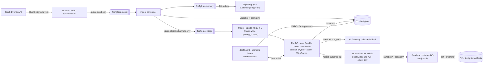
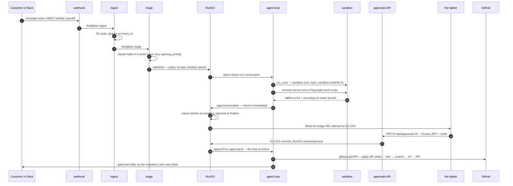

# Fire-Fighter Agent

> One agent that hears every message the team hears in Slack, wakes on the ones that matter, reproduces the bug on its own cloud machine, fixes it, records the proof, and opens a PR — with a structural boundary around every write, and a human gate on anything it says to a customer that commits us.

**Live:** https://firefighter.sayandeten.workers.dev · **Loom walkthrough:** _(link)_

---

## TL;DR

Slack → queue → **D1 (the record) + Zep (per-customer graph memory)** → triage (Haiku) → agent (Fable 5, Code Mode) → sandbox (no write credentials) → PR + Linear issue + proof video — with committal customer speech held for one dashboard click, and the run **resuming from** what the human decided.

Two mechanisms, and they are different things:

- **The write boundary.** Every capability declares an `effect` (`read | external_write | control_write | sandbox_write`); before any `external_write` (a Slack post, a Linear issue, a PR) the host re-reads channel policy and the shadow flag **from D1 at call time** — never from anything the model produced.
- **The human gate.** Anything the agent *says* to a customer that commits us — a date, a promise, a "no" — is drafted, parked, and waits for approve / edit / reject on the dashboard. Clarifying questions and status updates go straight out. *"A click per message is the failure this rule exists to prevent."*

The customer never sees a bot: replies go out under a fire-fighter's own Slack user token.

- **Stack:** Cloudflare Workers · Durable Objects · D1 · Queues · R2 · Workers Assets · Worker Loader (Dynamic Workers) · Cloudflare Sandbox (containers) · AI Gateway · Access · Hono · Vitest (`@cloudflare/vitest-pool-workers`) · Zep V3 · LangSmith
- **Docs:** spec `docs/superpowers/specs/2026-08-10-firefighter-agent-design.md` · phase plans + verification logs `docs/superpowers/plans/` · drill runbook `docs/drill.md`
- **Gate (no CI):** `cd apps/worker && pnpm test && pnpm typecheck && pnpm codemode:dts:check` — **117 files / 2228 passed, 14 expected-fail, 4 skipped; tsc clean; capability `.d.ts` in sync** (2026-08-17 at `b7d1c44`). The 14 `it.fails` are pinned open defects on a second, inactive run chassis (`RunAgent` on `@cloudflare/think`, behind `RUN_CHASSIS=legacy`); everything below describes the active one.

---

## How it works

One Worker, three entry points: a Hono `fetch` (Slack webhook, `/api/*`, `/ws/*`, OAuth, `/proofs/*`, asset fallthrough), one `queue()` handler across three queues, and a one-minute cron running four independent repair sweeps (memory outbox, undelivered approvals, nudges, orphan sandboxes).



**Ingest.** The webhook verifies the HMAC and does one queue send — under Slack's 3 s. The consumer drops DMs and bots unconditionally, dedupes on `event_id`, writes every message verbatim to D1, then fans out: memory for everything, triage only where channel policy allows and the message is not the app's own post (the loop guard). Channel policy fails closed: `observe` = ingest + triage, never post; `live` = postable; unmapped = nothing.

**Triage.** Haiku emits `{ wake, why, opening_prompt }` — never a ticket type. A thread already owned by a run absorbs the message with no model call.

**Run.** One `RunDO` per conversation is the sole session authority: turns, stream events, model messages, approval state live in its SQLite; D1 `runs` is a projection. The alarm drives the loop; the dashboard attaches over a hibernating WebSocket with an exact `?since=` replay.

**Agent.** Fable 5 through AI Gateway, exactly one tool: **`run_code`** — "run this TypeScript". Each call is one turn: the model writes a program, the program runs in a sealed Worker Loader isolate and calls our typed capabilities, returns what it found, and the model writes the next program.

**Sandbox.** A `@cloudflare/sandbox` container per run: clones `Zellify/web2app-rebuild`, edits, runs the dev server (port 4100), drives Playwright + ffmpeg for the proof video. It holds **no** GitHub/Slack/Linear credential — its git remote points at the sentinel host `git.firefighter.local` and `Sandbox.outboundByHost` swaps in `MONOREPO_PAT` at Worker egress, path-pinned to the one repo.

**Ship.** `sandbox.diff` → R2 → `src/git/apply.ts` (byte-exact unified diff; refuses renames/binaries) → blobs → tree → commit → ref → PR against pinned `GITHUB_BASE=staging`. `Fixes FIR-n` is the first line of the PR body, rendered by the host, never typed by the model. Proof recordings land in R2 under `proofs/` and are served Access-bypassed at `/proofs/:key` so Slack and GitHub can play them; every other artifact stays behind the login wall.

### One customer message becoming a PR



### Trust boundaries

Credentials exist in exactly one of the three boxes.


`guardLoader` (`src/codemode/guarded-loader.ts`) *sets* `globalOutbound: null`, an empty `env`, one module, no tails, clamped CPU; `executor.ts` adds a parent-side wall-clock race. Every capability is built by `auditedCapability` — a bare descriptor throws at registry construction — and must declare an `effect`. `read`, `control_write` and `sandbox_write` pass the guard, which is why a shadow run can still investigate, escalate and boot a container without being able to speak.

---

## The agent's capabilities

One tool (`run_code`); inside it, these namespaces (`src/codemode/bindings/*.ts`). **Bold** = `external_write`, gated on channel policy at call time.

| Namespace | Methods | What it does |
|---|---|---|
| `slack` | `thread`, `searchMessages`, **`reply`** | Read this thread / this customer's history from D1; post into this thread only, under a fire-fighter's user token. |
| `memory` | `findCustomers`, `recall`, `cite` | Zep graph recall by scope; the model can't name a graph; `cite` accepts only ids `recall` returned in the same execution and resolves through D1 to a real permalink. |
| `linear` | **`createIssue`**, `findIssue`, **`updateIssue`** | Team pinned server-side. |
| `github` | **`openPR`**, `checkPR`, `searchPRs` | Repo + base pinned server-side; PR from this run's `diffRef`. |
| `sandbox` | `boot`, `exec`, `spawn`, `checkProcess`, `killProcess`, `readFile`, `writeFile`, `preview`, `diff` | This run's container. Long work is spawned and polled on later turns; dev env injected per process behind a flag and redacted on the way back. |
| `browser` | `record`, `checkRecording` | Playwright with video, in the container; mp4 streamed to R2 `proofs/`. |
| `approval` | `escalate`, `withdraw` | Park the run for one human decision on one drafted customer reply. |
| `files` | **`publish`** | Bytes → R2 → Access-gated `/api/artifacts` URL. |
| `supabase` | `schema`, `select` | Read-only, allowlisted resources, structured filters, publishable key + RLS. |
| `langsmith` | `trace`, `searchTraces` | Read a customer's traces (project pinned). |
| `betterstack` | `logs`, `monitors` | Production logs over a window; monitor state. |

The agent's own runs are traced to LangSmith project `fire-fighter` (`src/langsmith/tracer.ts`: one `chain` per continuation, one `llm` per step, one `tool` per `run_code`; flushed once, off the critical path, never carrying reasoning). It is telemetry, not a capability — nothing the model writes can reach it.

---

## Cost

Queried out of production D1 on **2026-08-17**, after the drill runs. Nothing here is an estimate.

| Source | Model | Volume | Cost |
|---|---|---|---|
| `agent_model_calls` | `claude-fable-5` via AI Gateway | 480 calls across 28 runs | **$27.47** |
| `triage_decisions` | `claude-haiku-4-5` | 37 decisions, 31 `wake: true` | **$0.04** |
| | | **Total model spend** | **$27.51** |

**Prompt caching is why this fits a trial budget:** 92.3 % of input tokens were cache reads (449 of 480 calls); the same traffic uncached would have cost **$105.91**. Per run: $0.98 mean, $0.30 cheapest, $4.17 most expensive (a 50-step run that hit the spend guard after a follow-up in-thread). **The honest marginal cost of one PR is $1.25–2.50** — the four runs that shipped PRs on `Zellify/web2app-rebuild` (#1506, #1507, #1508, #1534) cost $1.45, $2.42, $2.03 and $1.24.

Zep, Better Stack, LangSmith and Supabase are on free tiers; Slack, GitHub and Linear cost nothing beyond existing seats; Cloudflare is Workers Paid ($5/mo base). **Measured spend is $27.51 of the $500 ceiling — 5.5 %.**

---

## Running it

pnpm 10.33.4 + Turborepo, Node ≥ 20. `apps/worker` is the product; `apps/dashboard` is the SPA the Worker serves.

```bash
pnpm install
cd apps/dashboard && pnpm build      # dist/ is the Worker's ASSETS dir — build before dev/deploy/tests
cd ../worker
cp .dev.vars.example .dev.vars       # local secrets, gitignored; not needed for tests

pnpm test && pnpm typecheck && pnpm codemode:dts:check   # the gate — there is no CI
pnpm dev                              # wrangler on :8787; dashboard `pnpm dev` proxies to it
env -u CF_API_TOKEN pnpm run deploy   # builds the dashboard, then wrangler deploy
```

Production secrets go in with `wrangler secret bulk` — never bare `wrangler secret put` from a non-interactive shell (uploads an empty string and reports success). Non-secret pins (`GITHUB_REPO`, `GITHUB_BASE`, vendor ids, mode flags) live in `wrangler.jsonc` `vars` on purpose. Never deploy with `AGENT_MODEL_DISABLED` or `SANDBOX_DISABLED` set. Firing a drill posts to a real Slack channel and opens a real PR — read `docs/drill.md` first.

The long-form README (security model with per-invariant mechanisms, spec-vs-build differences, AI-tool notes on Worker Loader / Sandbox / Think / Zep, Access setup, channel policy, what the sandbox may know) is in git history: `git show d2d794f:README.md`.
