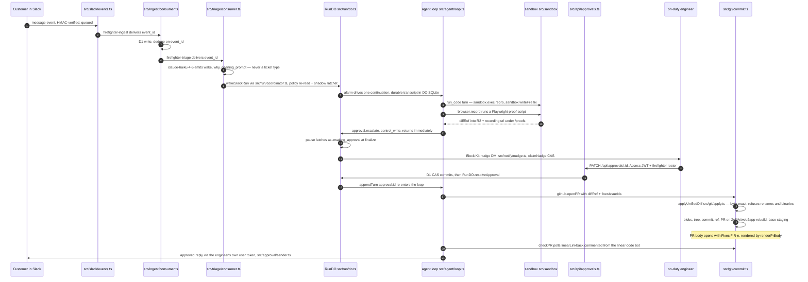
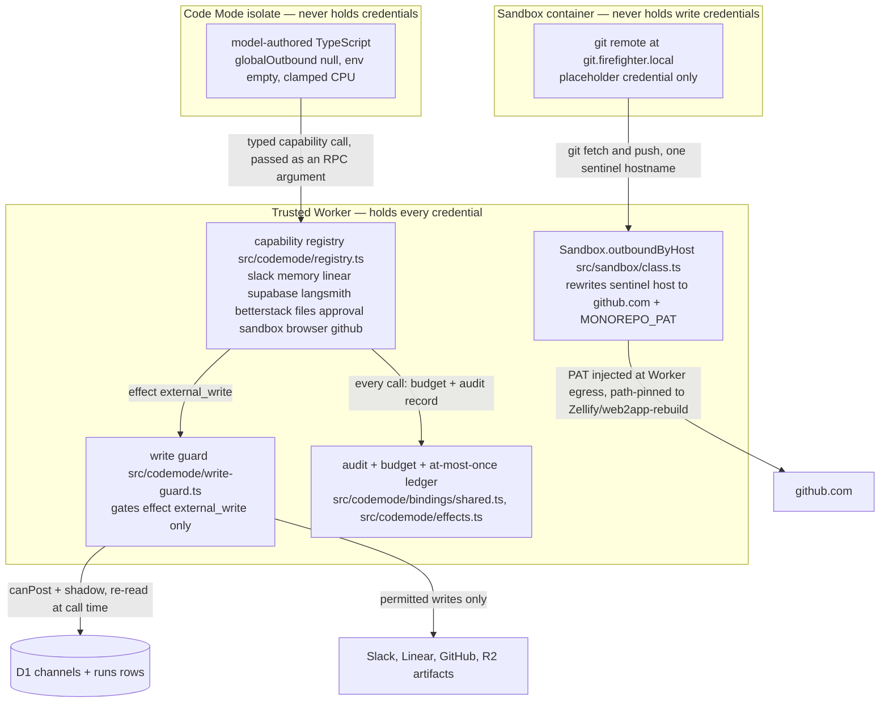

# Fire-Fighter Agent

One agent that hears every message the team hears in Slack, wakes on the ones that matter,
reproduces the bug on its own cloud machine, fixes it, and opens a PR. Every write is
gated by a mandatory effect class checked against the database at call time; on top of
that, anything it *says* to a customer that commits us waits behind one dashboard click.
Those are two different mechanisms, and the second one is about speech, not code. It is one Cloudflare Worker on one origin, with no server to keep alive
and no orchestration framework underneath it.

**The pipeline, end to end:** Slack → queue → D1 + Zep → triage (Haiku) → agent (Fable 5,
Code Mode) → sandbox (no write credentials) → PR + Linear issue + proof video, with
committal customer speech held for a dashboard click.

- **Origin:** https://firefighter.sayandeten.workers.dev
- **Stack:** Cloudflare Workers · Durable Objects · D1 · Queues · R2 · Workers Assets ·
  Worker Loader · Cloudflare Sandbox · Hono · Vitest (`@cloudflare/vitest-pool-workers`)
- **Spec:** `docs/superpowers/specs/2026-08-10-firefighter-agent-design.md` ·
  **Phase plans:** `docs/superpowers/plans/` · **Drill runbook:** `docs/drill.md`
- **Gate:** `cd apps/worker && pnpm test && pnpm typecheck && pnpm codemode:dts:check` —
  **104 test files / 2133 passed, 2 skipped; tsc clean; capability `.d.ts` in sync**
  (measured 2026-08-16 at `05185b1`). There is no CI; those three commands are the gate.

---

## Architecture

One Worker (`apps/worker/src/index.ts`) with three entry points: a Hono `fetch` (Slack
webhook, `/api/*`, `/ws/*`, OAuth, `/proofs/*`, asset fallthrough), one `queue()` handler
that switches on `batch.queue` across three queues, and a one-minute `scheduled()` cron
running four independent repair sweeps — memory outbox, undelivered approvals, nudges,
orphan sandboxes — through `Promise.allSettled`.

### Runtime topology

```mermaid
flowchart LR
  SLACK["Slack Events API"] -->|"HMAC-signed event_callback"| HOOK["Hono fetch<br/>POST /slack/events"]
  HOOK -->|"event_id + raw event, nothing else"| INQ[["queue firefighter-ingest"]]
  INQ -->|"batched jobs"| ING["ingest consumer"]
  ING -->|"event_id + verbatim text + permalink"| D1[("D1 binding DB<br/>database firefighter")]
  ING -->|"event_id of every stored message"| MEMQ[["queue firefighter-memory"]]
  ING -->|"event_id, triage-eligible channels only"| TRIQ[["queue firefighter-triage"]]
  MEMQ -->|"episode text via D1 outbox"| ZEP["Zep V3 graphs<br/>customer + org"]
  TRIQ -->|"thread + recall context"| TRI["triage consumer<br/>claude-haiku-4-5"]
  TRI -->|"wake + opening_prompt, shadow ratchet applied"| RUNDO["RunDO Durable Object<br/>binding RUNS, WebSocket hibernation"]
  RUNDO -->|"transcript + one tool run_code"| GW["AI Gateway<br/>claude-fable-5"]
  RUNDO -->|"model-authored TS, capabilities as RPC args"| ISO["Worker Loader isolate<br/>binding LOADER, globalOutbound null"]
  ISO -->|"sandbox.exec, writeFile, diff, browser.record"| BOX["Sandbox container DO<br/>binding SANDBOX, keyed run:runId"]
  BOX -->|"unified diff + proof recording mp4"| R2[("R2 binding ARTIFACTS<br/>bucket firefighter-artifacts")]
  RUNDO -->|"projection rows when projection_seq increases"| D1
  DASH["dashboard SPA<br/>Workers Assets binding ASSETS, behind Access"] -->|"live stream events over /ws"| RUNDO
  DASH -->|"PATCH approvals, Access JWT + roster"| D1
```



The webhook (`src/slack/events.ts`) does exactly three things inside Slack's 3-second
window: verify the HMAC, send to `INGEST_QUEUE`, return 200 — no D1, no fetch. The ingest
consumer (`src/ingest/consumer.ts`) is idempotent on `event_id`, writes every message
verbatim to D1 (the system of record), then fans out: `MEMORY_QUEUE` for every stored
message, `TRIAGE_QUEUE` only when channel policy allows triage and the message is not the
app's own post — the loop guard. One `RunDO` per conversation (`src/run/do.ts`) is the sole
session authority; its SQLite holds turns, stream events and approval state, D1 `runs` is a
projection applied only when `projection_seq` increases, and dashboard WebSockets hibernate
via `ctx.acceptWebSocket`.

### One customer message becoming a PR



Triage (`src/triage/consumer.ts`) stores its decision in D1 before waking, so a queue retry
replays the wake instead of re-asking the model; a thread already owned by a run absorbs the
message with no model call at all (`routeToOwnedRun`). The coordinator
(`src/run/coordinator.ts`) re-reads channel policy on every wake and applies the shadow
ratchet (false→true only) before any turn exists. The ship path (`src/git/commit.ts`) reads
the stored diff out of R2, fetches each touched file at the base commit, applies it
byte-exactly (`src/git/apply.ts` refuses fuzzy matches, renames, binaries and symlink-mode
surprises), then builds blobs→tree→commit→ref→PR against the server-pinned `GITHUB_REPO` /
`GITHUB_BASE`. The `Fixes FIR-n` line is rendered by `renderPrBody` in
`src/codemode/bindings/github.ts`, never typed by the model.

### Trust boundaries

This is the diagram worth studying. Credentials exist in exactly one of the three boxes.



The isolate is loaded through `guardLoader` (`src/codemode/guarded-loader.ts`), which *sets*
— not defaults — `globalOutbound: null`, an empty `env`, no tail workers, and clamped
CPU/subrequest limits, so its only reach is the typed capabilities handed across as RPC call
*arguments*; `src/codemode/executor.ts` adds a parent-side wall-clock race on top, because
`limits.cpuMs` is only enforced on a deployed Worker. Every capability is built by
`auditedCapability` — a bare descriptor throws at registry construction — and declares an
`effect` of `read | external_write | control_write | sandbox_write`. `assertEffectPermitted`
re-reads channel policy and the run's `shadow` flag *from D1 at call time* for anything
classified `external_write`; `read`, `control_write` and `sandbox_write` pass, which is why a
shadow run can still investigate, escalate, and boot a container without being able to speak.

The container holds no write credential. Its git remote points at `git.firefighter.local`,
which resolves nowhere, and the static `Sandbox.outboundByHost` handler in
`src/sandbox/class.ts` rewrites that one hostname to `github.com` at Worker egress, swaps the
placeholder for `MONOREPO_PAT`, and refuses any path outside `Zellify/web2app-rebuild`.

---

## Security model

Every claim below is traceable to code and to a test. The counts are from a run of exactly
these 30 files on 2026-08-16 at `05185b1`: **30 files, 598 passed, 1 skipped**
(the skip is the CPU-burn case, which cannot be proven under the local pool — see the
AI-tool notes). Paths are relative to `apps/worker/`.

| # | Claim, as built | Enforcing code | Tests (passing) |
|---|---|---|---|
| 1 | Slack's `v0` HMAC is verified with a ±300 s replay window before any I/O; the handler then does one queue send and returns 200 | `src/slack/verify.ts:34,43-49` (constant-time compare `:7-14`); `src/slack/events.ts:16-22,41` | `test/verify.test.ts` (7) · `test/events.test.ts` (5) |
| 2 | DMs and mpims are dropped unconditionally at ingest; so are all foreign bots. The app's **own** user-token posts are kept as `ingested_self` — stored and remembered, never re-triaged — which is the loop guard | `src/ingest/rules.ts:51,52,54-79` (unconfigured self fails safe to drop) | `test/rules.test.ts` (19) · `test/ingest.test.ts` (9) · `test/counters.test.ts` (8) |
| 3 | Unmapped channels fail closed for triage and posting. They are still **ingested** — that is deliberate, not an oversight: requirement 1 is that everything is heard | `src/db/channels.ts:23-26,30-32,107-109` | `test/channels.test.ts` (11) · `test/ingest.test.ts` (9) · `test/codemode-write-guard.test.ts` (21) |
| 4 | `canPost()` is enforced host-side inside the capability layer, never in a prompt — and one layer more general than the spec asked: it sits in the shared guard applied to *every* `external_write`, not only `slack.reply` | `src/codemode/write-guard.ts:117-123`; wired at `src/codemode/registry.ts:255`; declared at `src/codemode/bindings/slack.ts:97-98` | `test/codemode-write-guard.test.ts` (21) · `test/codemode-slack.test.ts` (25) · `test/codemode-security.test.ts` (41) · `test/slack-reply-identity.test.ts` (22) |
| 5 | Ingest is idempotent on `event_id`; Slack's retries converge on one run and one opening turn. "Never a second PR" is a *separate* mechanism — the effect ledger plus update-don't-create | `src/db/messages.ts:16`; `src/ingest/consumer.ts:25-33`; `src/triage/consumer.ts:88-101`; `src/codemode/effects.ts:285-290` | `test/ingest.test.ts` (9) · `test/triage-consumer.test.ts` (9) · `test/run-triage.test.ts` (11) · `test/github-gateway.test.ts` (49) |
| 6 | The Tier 1 isolate runs with `globalOutbound: null` forced (a caller-supplied value is discarded), an env asserted empty, and clamped CPU/subrequests; a parent-side wall-clock race sits on top | `src/codemode/guarded-loader.ts:27-31,77-86`; `src/codemode/executor.ts:212-246` | `test/codemode-guarded-loader.test.ts` (14) · `test/codemode-security.test.ts` (41, +1 skipped) · `test/codemode-loader.test.ts` (3) · `test/codemode-isolation.test.ts` (12) |
| 7 | The write guard re-reads channel policy **and** the run's shadow flag from D1 at call time, not at composition time; a missing `runs` row refuses | `src/codemode/write-guard.ts:117,130-138,156-162` | `test/codemode-write-guard.test.ts` (21) — including a policy flipped to `observe` mid-run stopping the *next* write |
| 8 | The effect ledger is at-most-once per (run, turn, namespace, method, args-hash), coordinated in D1, and survives a Worker restart | `src/codemode/effects.ts:285-293,400-405`; in-doubt refusal `:234` | `test/codemode-effects.test.ts` (21) · `test/codemode-security.test.ts` (41) |
| 9 | The sandbox container holds no write credential: it receives the sentinel host and a placeholder, and the PAT is substituted at Worker egress for one pinned repo | `src/sandbox/class.ts:40,109,137-155` | `test/sandbox-lifecycle.test.ts` (23). **Partial:** the container-side half is proven by test; the egress swap itself has no test — see the gaps below |
| 10 | Dev-tier env is injected **per process**, only when model code sets `injectDevEnv`, and known values are redacted from every return path — stdout, stderr, process tails, file reads | `src/sandbox/env.ts:74-83,150-158`; `src/sandbox/gateway.ts:125-141,231-234` | `test/sandbox-env.test.ts` (22) · `test/codemode-sandbox.test.ts` (51) |
| 11 | Approval needs a verified Access JWT plus roster membership (viewers read, fire-fighters `PATCH`), and a D1 CAS makes exactly one decision win; the loser gets 409 naming the winner | `src/api/approvals.ts:134-141,189,206,250`; `src/access/roster.ts:22-53`; `src/approval/repository.ts:167-201` | `test/approval-api.test.ts` (24) · `test/approval-repository.test.ts` (40) · `test/access-jwt.test.ts` (17) · `test/approval-e2e.test.ts` (11) |
| 12 | Customer-facing **Slack replies** go out under the on-duty engineer's user token. A missing identity terminates as `blocked` — there is never a bot-token fallback, even though a working bot token is right there | `src/approval/sender.ts:56-73,98-126`; `src/identity/user-token.ts` | `test/slack-reply-identity.test.ts` (22) · `test/user-token-sender.test.ts` (11) · `test/codemode-slack.test.ts` (25) |
| 13 | Secrets never reach prompts, events, tool output, logs or memory (invariant 39). There is no single choke point — it is enforced at each surface and swept by a planted-canary test | `src/codemode/bindings/shared.ts:178-205`; `src/sandbox/gateway.ts:231-234`; `src/betterstack/client.ts:45-59`; `src/sandbox/env.ts:39-83`; `src/agent/ports.ts:47`; `src/memory/consumer.ts:425` | `test/agent-canaries.test.ts` (5) — sweeps the model call, events, turns, transcript, D1, memory and logs, with a control proving the probe works · `test/codemode-security.test.ts` (41) |
| 14 | The Linear team and the GitHub repo/base are pinned server-side; the bindings take no destination argument, and base `dev` is refused by name | `src/agent/dependencies.ts:272`; `src/codemode/bindings/linear.ts:26`; `src/git/commit.ts:82-84,454,518,557` | `test/codemode-linear.test.ts` (63) · `test/github-gateway.test.ts` (49) |
| 15 | Triage emits only `{wake, why, opening_prompt}` — the Zod schema is the enforcement, because no ticket-type field exists — and nothing downstream branches on a type | `src/triage/run.ts:12`; `src/triage/prompt.ts:12-20`; `src/agent/loop.ts:100`; `src/agent/prompt/policy.ts:51` | `test/triage-run.test.ts` (6) · `test/triage-prompt.test.ts` (3) · `test/run-api.test.ts` (35) |

### Where the coverage stops

Two claims are weaker than the rest, and saying so is the point of the table.

- **The Worker-egress PAT swap has no test.** `Sandbox.outboundByHost`
  (`src/sandbox/class.ts:137-155`) — including the `forbidden_repo` refusal — runs on the
  real Durable Object class and no test invokes it. What *is* proven by test is the half
  that matters most for exfiltration: the container only ever receives the sentinel URL and
  a placeholder credential (`test/sandbox-lifecycle.test.ts:142-161`). The swap itself is
  verified live, by the fact that clones and pushes work at all.
- **"The webhook does no I/O" is asserted only for D1.** `test/events.test.ts:54` proves no
  D1 write in the request path; nothing asserts the absence of a `fetch`. That property is
  currently held by the shape of `src/slack/events.ts`, which has no other call, not by a
  test.

One more caveat belongs here rather than in a footnote. Redaction of dev-tier values has a
floor: values shorter than 16 characters are left alone (`MIN_REDACTABLE_LENGTH` in
`src/sandbox/gateway.ts`), because redacting every occurrence of a three-letter value would
destroy the build logs it appears in. And redaction never defeats deliberate encoding — a
model that runs `env | base64` wins. The argument that makes this acceptable is not the
redactor; it is that these are dev-tier **read** credentials, disjoint from every write path,
and that the container has no write credential to pair them with.

### Where the spec and the build differ

Spec §8 is the security model as *designed*. Where the build learned something, the code
wins; these are the six places it did.

1. **§8.3, the container's git credential — resolved, and stronger than the spec.** The spec
   offered a priority list ("`interceptHttps` + `outboundByHost` swap → Worker-side git proxy
   → 1-hour read-only token") marked *not yet verified*. The first option shipped, and it is
   stricter than any of the fallbacks: the container holds a placeholder rather than a
   short-lived credential, and the sentinel proxies exactly one repository. The spec's "one
   unavoidable container credential" does not exist.
2. **§8.1, "the isolate cannot `fetch`" — same property, different mechanism.** `fetch` exists
   in the isolate; every outbound request is *refused*. `test/codemode-security.test.ts` is
   literally titled "outbound access is refused, not absent" and records the verbatim refusal
   message. A test written against the spec's wording would fail on a correct configuration.
3. **§8.5, "policy is enforced inside the bindings" — strengthened after a real gap.** Phase 09
   built it exactly as spec'd, inside `slack.reply` alone, which left a shadow run able to file
   a Linear issue. The repair moved channel and shadow gating to the shared effect-class guard
   applied to every `external_write` (`src/codemode/bindings/slack.ts:158-170`).
4. **§8.2, "nothing in the container to exfiltrate" — a carve-out was added and has to be
   stated, not glossed.** Dev-tier env is injected per process when the model asks
   (`src/sandbox/env.ts:150`), so dev-tier read-scoped values *do* exist inside a container
   process while a dev server runs. See the caveat above.
5. **§8.7, Access-bypassed paths — one more than the spec lists.** The spec names
   `/slack/events` and `/oauth/*`. `/proofs/:key` is also bypassed (`src/api/proofs.ts`,
   `src/index.ts:224-227`) so that Slack's unfurler — and a customer clicking cold — can fetch
   a proof recording. Protection there is unguessable R2 keys and uniform 404s, not Access.
6. **§8.6, the roster — the override is realized in code, and the count differs.** The spec says
   seven addresses and mentions the personal-email override only on the Access side. The build
   maps eight, with `sayandeten@gmail.com` in `FIREFIGHTERS`, tagged `G2-TEMP-OVERRIDE`. See
   *Access and the temporary override* below.
7. **PR authorship — the deployed value is `worker-pat`, not the engineer.** `src/git/commit.ts:102`
   resolves `GITHUB_AUTHOR` to one of `on-duty | worker-pat`, and `wrangler.jsonc` sets
   **`worker-pat`**: PRs are authored by the ship credential's owner, not by the on-duty
   engineer's OAuth identity. The `on-duty` path is built and reachable — it is one value away —
   but it is not what is running, and the distinction matters because the **Slack reply** genuinely
   does go out under the engineer's own user token. Only half of "under the on-duty engineer's
   name" is true today, and it is the Slack half. Flipping the flag additionally requires a GitHub
   OAuth identity row for that engineer.

---

## Cost

Everything here was queried out of production D1 on **2026-08-16**, *after* the Phase 23 drill
runs, so the figures include them rather than predating them. Anything that could not be
measured says so; nothing here is an estimate wearing a measurement's clothes.

### Model spend — measured

| Source | Model | Volume | Cost |
|---|---|---|---|
| `agent_model_calls` | `claude-fable-5` via AI Gateway | 426 calls across 25 runs | **$22.8935** |
| `triage_decisions` | `claude-haiku-4-5` | 32 decisions, 28 of them `wake: true` | **$0.0364** |
| | | **Total model spend** | **$22.93** |

Window: first agent call 2026-08-13 13:30 UTC, last 2026-08-16 during the drill. Triage averages
under 3 s and about a tenth of a cent per decision. `agent_model_calls` stores integer
`cost_nano_usd`, not floating dollars (invariant 29) — the dollar figures above are that
integer divided out at the end, once.

**Token split:** 7,996,891 input (7,369,732 cache read · 626,307 cache write · 852 uncached)
and 153,729 output.

**Prompt caching is the reason this fits in a trial budget.** 92.2 % of all input tokens were
served from cache, and 398 of 426 calls (93.4 %) had a cache read. Priced at the table in
`src/agent/cost.ts` ($10 / Mtok input, $12.50 / Mtok 5-minute cache write, $1 / Mtok cache
read, $50 / Mtok output), the identical traffic with no caching would have cost **$87.66**.
Caching saved **$64.76 — 73.9 %**.

**Per run:** $0.92 across the 25 runs that made model calls. The distribution matters more than
the mean — the most expensive run was $2.42 over 34 steps, the cheapest $0.30 over 10. The two
Phase 23 drill runs sit at either end of the useful range: a how-to question answered in 15
steps for **$0.91**, and a small feature request taken all the way to a merged-ready PR in 30
steps for **$2.03**.

**Per PR:** three PRs have been opened on `Zellify/web2app-rebuild` — **#1506**
(`fix/nav-cta-copy`), **#1507** (`fix/remove-careers-nav-link`), both closed with nothing merged,
and **#1508** from the Phase 23 drill. Dividing all model spend by three gives **$7.64 per PR**,
which flatters nothing: it charges every exploratory and failed run to those three. The three
runs that actually shipped cost **$1.45**, **$2.42** and **$2.03**. Roughly **$2 is the honest
marginal cost of one PR**, and the consistency across three independent runs is the useful part.

### Cloudflare — partly measured

Workers Paid is structurally required (Durable Object SQLite and containers), list price $5 /
month. **The account's billing API is not readable with the deploy token in use** — it returns
an authentication error — so the invoice itself is **unverified** here rather than reported.

Measured, over the seven days to 2026-08-16:

- **Worker requests:** 21,848 on `firefighter`, 2 errors, 2,267 subrequests. Most of that is
  the one-minute cron (10,080 firings per week). The Workers Paid plan includes 10 M
  requests/month, so this is roughly 1 % of the included allowance.
- **D1:** the `firefighter` database is 643,072 bytes.
- **Container:** application `firefighter-sandbox`, a `standard-4`-shaped Firecracker VM —
  4 vCPU, 12 GiB memory, 20 GB disk — capped at 3 instances, image version 13.

**Unmeasured:** container minutes, Durable Object GB-seconds and requests, R2 storage and
operations, and queue message operations. Those analytics datasets returned empty for the
token in use. They are the one component of the total that this document cannot put a number
on.

### The other vendors

Zep, Better Stack, LangSmith and Supabase are all on **free tiers — $0**. Slack, GitHub and
Linear cost nothing beyond the workspace seats Zellify already has.

### Against the $500 ceiling

Measured spend is **$22.93 of $500 — 4.6 %, leaving $477.07** — plus an unmeasured Cloudflare
component bounded by the plan base and the usage figures above, which are far inside every
included allowance. There is no plausible arithmetic in which the unmeasured part moves this
into the same order of magnitude as the ceiling.

---

## AI-tool notes

Every entry below is a case where the model — or its training-data-era docs — confidently
asserted an API that did not exist, had moved, or behaved differently, and what settled it.
The method that worked, repeatedly: read the installed `.d.ts` in `node_modules` (or `npm
pack` the exact version *before* installing), read the compiled `dist/*.js` when the
declarations are silent, then confirm with one live probe. Several of the worst traps are
invisible in declarations and appear only in the emitted JavaScript; several more are
invisible locally and appear only once deployed.

### Cloudflare Worker Loader / Code Mode (`@cloudflare/codemode`)

The thinnest surface of all. Worker Loader is an open beta the billing page calls "Dynamic
Workers"; `@cloudflare/codemode@0.5.1` was read from its published tarball before a line was
written against it.

- The model asserted the isolate "has no `fetch`" under `globalOutbound: null`. Wrong:
  `typeof fetch === "function"`, and it throws on **invocation** — *"This worker is not
  permitted to access the internet via global functions like fetch()"*. A test asserting
  absence fails against a correct configuration. The deployed spike ran the control (field
  omitted → 200 from the open internet) to make the claim causal.
- Inherited notes said raw DO stubs cannot cross into the isolate's `env` while `RpcTarget`
  subclasses can. Both halves are wrong: raw stubs and `ctx.exports` entrypoints work in
  `env`, and **any** `RpcTarget` throws `DataCloneError` at `load()` — even one wrapping a
  single string. As a call *argument* an `RpcTarget` is fine. Placement decides, not type.
  Found by bisecting `env` one member at a time on a deployed Worker.
- `props` does not belong on the code bundle; it goes on `getEntrypoint(name, { props, limits })`.
- `limits.cpuMs` is enforced **only** on a deployed Worker — not under `wrangler dev`, not in
  the vitest pool — and even deployed its relation to wall time is loose (a 50 ms budget
  killed a burn after 16 ms; a 200 ms budget took 1519 ms). Locally, a `while (true) {}`
  isolate is never killed, pins workerd at ~75 % CPU, and wedges every later test *including
  vitest's own `--testTimeout`*. That is the one skipped test in the security suite.
- The package's own `timeout` option compiles **into** the generated module as an in-sandbox
  `Promise.race`, so non-yielding code never lets it fire. A parent-side race is mandatory in
  addition, not instead — with a `.catch(() => {})` on the loser to swallow the late rejection.
- There are two `resolveProvider`s. The bare one — the natural `import { runCode }` path —
  performs **no** schema validation; its own dist comment says so. The `/ai` one validates but
  throws `JSON.stringify(zodIssues)`, which echoes submitted values back. Since only
  `err.message` survives the isolate boundary, production uses the bare resolver plus its own
  validation layer.
- `ToolDispatcher.call` forwards only `err.message` across the boundary — no `name`, no
  `stack`, no class — so `instanceof` is worthless there. Error codes have to live inside the
  message string.
- Host tools cross as `entrypoint.evaluate(dispatchers, connectorBindings)` — a call argument,
  never `env` (which is `void 0` unless configured); `load()` is called with **no** `limits`
  field at all; and the bundle hardcodes `compatibilityDate: "2025-06-01"`. All three were read
  out of `dist/index.js` and none is visible in the `.d.ts`. A wrapping guard loader is the
  only place to force real limits and the project's actual compat date.
- `generateTypes()` silently degrades a capability to `type XInput = unknown` — telling the
  model nothing about *any* argument — when one field's Zod schema cannot render to JSON Schema
  (`z.instanceof(Uint8Array)`, `z.custom()`, `.meta({type})` all reproduce it). It also derives
  type names from the method name alone, so `slack.search` and `langsmith.search` both emit
  `type SearchInput` and the joined `.d.ts` breaks — method names must be globally unique
  across namespaces.
- A zero-argument call fails validation: the sandbox proxy forwards `foo()` as
  `execute(undefined)`, which a Zod object rejects even with all keys optional.
  `z.object({}).default({})` fixes it without degrading the generated type.
- `resolveProvider` silently **drops** any tool carrying `needsApproval` (`filterTools()`, no
  warning). If you do not use approval annotations, assert their absence in a test so the drop
  can never become silent.
- The binary codec is real but is base64-inside-JSON: a `Uint8Array` crosses tagged
  `__codemode_binary_v1__`, so 5 MiB becomes ~6.7 MB over RPC — measured at 190 ms round-trip.
  Relatedly `maxConsoleChars` is a context bound, not a memory bound: the whole `__logs` array
  crosses RPC before any host cap runs.
- An enumeration probe reading `await slack[name]` reports fifteen credential "leaks" that do
  not exist — the in-sandbox capability object is a `Proxy` whose `get` trap returns a dispatch
  function for *every* key. The honest probe **invokes**: `await slack[name]()` → *Tool "DB" not
  found*. It then finds nothing, while still catching a planted control.
- `get()` caches by name and silently runs **stale** code; `load()` is uncached and costs ~8 ms
  deployed. Model-authored code must always go through `load()`; the guard throws on `get()`.
- Console capture via `tails` truncates silently by **bytes** (~200 KB), with no marker, and
  production truncates earlier than local.

### Cloudflare Sandbox SDK (`@cloudflare/sandbox`)

The docs hub pages carry no API surface; the installed `.d.ts` was the only reliable source —
and even it hides the two worst traps, which live in the compiled `container.js`.

- The model produced `timeoutMs` on exec and port options in three separate places. It is
  `timeout`.
- `interceptHttps`, static `outboundByHost`, `allowedHosts`/`deniedHosts` and `sleepAfter` are
  inherited from `Container` in `@cloudflare/containers`, not declared on `Sandbox` — grepping
  the sandbox package finds nothing and reads as "removed".
- Runtime `setOutboundByHost()` looks like a strict improvement on the module-scope static. It
  silently promotes the container to **intercept-all** (`interceptOutboundHttps('*')`) until
  restart. None of that is in the `.d.ts` — only in the compiled `container.js`.
- `ProcessOptions.autoCleanup` defaults to **`true`**, deleting a finished process's record —
  so `getProcess` returns null, a boot poll relaunches provisioning forever, and "the process
  table is the state" becomes impossible. `autoCleanup: false` is the single most load-bearing
  option in the Tier 2 design, and it appears in neither the docs nor the spike.
- `waitForPort` is declared only on the `Process` handle, not the sandbox; it defaults to
  `mode: 'http'` and demands a success status, so a 500-ing but listening app reads as dead; a
  process that fails it is **not reaped**, so the next attempt dies `EADDRINUSE`. Worst: port
  3000 is the sandbox's own control server, so `waitForPort(3000)` succeeds against a dev server
  that never started.
- `tunnels.*` requires `transport: "rpc"` in `getSandbox` and throws at **call** time, not
  construction; a fresh tunnel returns 530 for ~10 s, so a single probe reads as broken.
- `readFile(path, { encoding: 'none' })` returns `content: ReadableStream<Uint8Array>` —
  streamable straight into `R2Bucket.put` — but is RPC-transport only; HTTP and WebSocket throw.
- `Process.startTime` is typed `Date` and is one over RPC — but a plain ISO **string** under the
  HTTP transport. The transport is a call-site option, not a type.
- `ContainerProxy` must be imported from `@cloudflare/sandbox`, never `@cloudflare/containers`,
  and must be re-exported from the Worker entrypoint or interception fails at runtime. Stated
  only in a `.d.ts` comment.
- A container `image` in `wrangler.jsonc` naming a missing Dockerfile path is a **config-parse**
  failure: it takes down `wrangler types` and the entire vitest pool before a single test loads.
  With a Dockerfile path, `wrangler deploy --dry-run` actually builds the image, and `wrangler
  deploy` cannot pass a BuildKit secret — the path is `docker build --secret` → `wrangler
  containers push` → registry URI. Deploying a new image does **not** recycle a running
  container; `destroy()` does.
- The base image ships Node 22 but `corepack` is not on `PATH` (pnpm has to come from `npm i
  -g`), and `NODE_PATH` is honoured only by CJS `require()` — an `.mjs` harness dies
  `ERR_MODULE_NOT_FOUND`, which is why the recording harness is `record.cjs`.
- `wrangler containers ssh` is broken platform-side: the API returns 200 with a websocket URL,
  then the SSH gateway refuses the upgrade with a 400. Reproduced on two wrangler versions.
- Two error-object traps that matter for leak sweeps: `JSON.stringify(err)` returns `{}`
  (`message` and `stack` are non-enumerable), so a stringify-based "nothing leaked" assertion
  passes while the secret sits in the field the model actually reads; and `JSON.parse`'s error
  message **quotes the input it choked on**, so parsing a secret-valued blob can quote a
  credential straight into a log.
- A Worker secret is capped at 5.1 kB, which forced the injected dev-env from 115 keys down to a
  curated 28 — an accidental shove toward least privilege that the design then kept on purpose.
- Git through the egress proxy: git's defaults let a stalled transfer hang **forever**. The fix
  is `GIT_TERMINAL_PROMPT=0`, `http.lowSpeedLimit`/`lowSpeedTime`, and a per-attempt `timeout`.
  Also measured: `--filter=blob:none` saves nothing under `--depth 1` (checkout still
  materialises every blob at HEAD), and cone-mode sparse checkout cannot express "a directory's
  manifest but not its assets" — non-cone patterns can.

### Project Think (`@cloudflare/think`) and the Agents SDK (`agents`)

The thinnest surface in the repo, and the one the model was most confidently wrong about.
Everything below was read out of the published tarballs (`npm pack`, then `dist/*.js`, not
just the `.d.ts`) before a line was written against it. Versions are exact-pinned —
`@cloudflare/think@0.15.1`, `agents@0.20.1`, `@cloudflare/codemode@0.5.1` — because Code
Mode is marked experimental and the surface really does move between minors.

- **The blog posts are behind the packages.** `agents/codemode/ai` no longer exists; the
  entrypoint throws *"This entrypoint has been removed. Use `createCodeTool()` from
  `@cloudflare/codemode/ai` instead."* `AIChatAgent` has moved out of `agents` into
  `@cloudflare/ai-chat`. Project Think shipped as a real package, and `Think extends Agent`,
  so adopting Think adopts the Agents SDK by construction.

- **`Think.workspace` defaults to a real filesystem, and that silently reaches the model.**
  `createExecuteRuntime(agent, overrides)` merges `{...optionsFromAgent(agent), ...overrides}`,
  and `optionsFromAgent` sets `state: createWorkspaceStateBackend(agent.workspace)` plus
  `browser: env.BROWSER`. `workspace` is a **non-optional** property that defaults to a
  DO-SQLite `Workspace`, so the one-liner `createExecuteTool(this)` hands the model a
  `state.*` namespace the write guard never sees. `workspaceBash = false` does not prevent
  it — that only drops the `bash` tool. This project passes `state: undefined,
  browser: undefined` explicitly, and a test asserts the sandbox exposes neither.

- **`getTools()` is not the model's tool map.** Think assembles a turn as
  `{...workspaceTools, ...fetchToolSet, ...getTools(), ...actionTools, ...extensionTools,
  ...session.tools(), ...skillTools, ...mcpTools, ...clientToolSet}` (`think.js:2636-2652`) —
  six sources land *after* `getTools()`. The one that fills itself in unasked is
  `session.tools()`: a context block declared without a provider is auto-wired to a
  **writable** provider, which contributes a `set_context` tool. An "exactly one tool" check
  that reads `getTools()` reports everything fine while the model holds two.

- **`CodemodeRuntime` must be listed in a `new_sqlite_classes` migration, not merely
  exported.** `createCodemodeRuntime` reaches its facet through
  `ctx.facets.get(..., () => ({ class: ctx.exports.CodemodeRuntime }))`, and workerd only
  hands back a `LoopbackDurableObjectNamespace` for exports it has been told are Durable
  Object classes; a merely-exported class probes as a plain service stub and `facets.get`
  rejects it with *"Incorrect type for the 'class' field on 'StartupOptions'"*. Neither the
  docs nor Cloudflare's own vite plugin does more than export it. This applies to a deployed
  Worker, not just the test pool.

- **A lazy facet makes a naive smoke test pass against a broken class.** `getRuntime` runs
  eagerly at tool construction but the facet instantiates on first use, so
  `Object.keys(getTools())` succeeds even when the runtime cannot boot. The spike only found
  the bug above after the test was changed to actually call into the runtime.

- **`StepConfig` type-collapses to `{}`.** Think declares it as
  `Omit<PrepareStepResult<TOOLS>, "model">`, and the AI SDK's `PrepareStepResult` is a union
  ending in `| undefined`; `keyof` a union yields only its *common* keys, so the `Omit`
  collapses and `system` / `instructions` are rejected as excess properties — even though
  Think spreads the object straight into `streamText({ prepareStep })` and they work at
  runtime. The fix is to build a checked `PrepareStepResult` literal and widen on return.

- **`runTurn` is overloaded three ways and a DO RPC stub keeps only the last one**
  (`RunTurnStream → Promise<void>`), so the obvious `mode: "submit"` call fails to compile
  with *"'submit' is not assignable to 'stream'"*. Narrow the stub to a local typed
  interface built from the package's own exported option types.

- **Never call `runTurn` from inside a Durable Object RPC method.** It deadlocks: the
  submission is admitted to the turn queue, the queue cannot drain until the current
  operation returns, and the current operation is that call. It deadlocks *even unawaited*,
  because a DO holds the RPC open until in-flight promises settle — so
  `void runTurn(...).catch(...)` does not help. The post-approval re-entry is a
  `schedule(0, "reenterAfterApproval")` callback instead, which is also the right shape:
  the human clicking Approve gets an answer as soon as the decision is committed and the
  message sent, and the re-entry survives eviction. Cost of learning this the hard way: one
  test that hung for 55 minutes.

- **`useAgentChat` suspends.** It reads the transcript through React's `use()`
  (`agents/dist/chat/react.js:803`), so the component must sit inside `<Suspense>` and an
  error boundary — a rejected promise thrown out of render blanks the dashboard.

- **`@ai-sdk/react` is an optional peer that is not optional.** pnpm's `autoInstallPeers`
  skips it, but `agents/chat/react.js` imports `useChat` from it at runtime and the Vite
  build cannot resolve it. Pinned to `4.0.62` — the only 4.x whose `ai` dependency matches
  the `7.0.59` already in the tree, so the bundle carries one copy of `ai` rather than two.

- **`routePartykitRequest` names the Durable Object `idFromName(<third path segment>)`,
  verbatim and undecoded.** Mounting `routeAgentRequest` naively makes the browser's URL the
  DO name, which is exactly what "never string-build a DO name from a public id" forbids.
  The browser therefore addresses `/agents/run-agents/{runs.id}`, the Worker resolves
  `runs.key` from D1, re-validates it and rewrites the segment before routing; a caller who
  guesses a raw `slack:C…:…` key gets a 404, because a key is not an id. (The namespace slug
  is derived from the *binding* name `RUN_AGENTS`, giving `run-agents` — not the class name.)

- **Anything in the Worker entry's eager module graph cannot be `vi.mock`ed.**
  `vitest-pool-workers` evaluates that graph during pool boot, before any test file's
  `vi.mock()` registers, and does not re-evaluate it. A static
  `import { createProductionModelFactory } from "../agent/model"` in a hook module put
  `model.ts` on the far side of the mock and silently disabled the six assertions that prove
  the AI Gateway auth header is attached — the exact positive test written because deleting
  that header once left every check green while production sent unauthenticated requests.
  The control that proved the mechanism: mocking a module in the boot graph reached the
  test's own import but not another `src/` module's import of the same file. The model
  composer is now reached through `await import()`, primed in the constructor inside
  `ctx.blockConcurrencyWhile(...)` — the only point that gates every entry path at once
  (`onStart()` does not cover a direct RPC, and an approval re-entry arrives as one).
  `getModel()` has to stay synchronous because Think calls `resolveModel()` before
  `beforeTurn` (`think.js:2663` vs `:2670`).

- **Cold start is the real cost of this chassis.** Bundling the entry with esbuild under
  Workers conditions gives a ~10 MB eager graph — `just-bash` 1.79 MB, `zod` 734 KB,
  `agents` 719 KB, Zep 668 KB, `ai` 615 KB, `@cloudflare/sandbox` 490 KB,
  `@cloudflare/think` 466 KB, `@ai-sdk/anthropic` 297 KB — almost all of it pulled in by
  `RunAgent extends Think` being exported from the Worker entry, since `think.js` statically
  imports `agents`, `agents/chat`, `agents/skills`, `ai`, `@ai-sdk/openai`,
  `@cloudflare/shell` and `workers-ai-provider`. The Slack webhook's 3-second budget is
  genuinely exposed to that weight. Deferring it further is not possible while a Durable
  Object class is exported from the entry; this is recorded as a known cost, not solved.

- **Codemode replay is unreachable in this configuration, so the obvious test would prove
  nothing.** `CodemodeRuntime.decide(...)` is the only writer of `status = 'paused'`, in a
  single `if (requiresApproval)` branch, and that flag comes solely from the connector's
  `describe()` annotations. Because approval here is a model-called capability rather than a
  tool annotation, nothing ever sets it, so no pause and no resume pass occur — a
  pause/resume test would assert against *"only a paused run can be approved."* The
  at-most-once proof is written at the seam a replay pass would actually cross instead.

### Agents SDK, Durable Object hibernation, and the vitest workers pool

Everything here compiles. Half of it fails only after hibernation, or only under `pnpm
typecheck`, because vitest strips types.

- `instance.ctx` inside `runInDurableObject` does not typecheck — `ctx` is `protected` on the
  `cloudflare:workers` base class. The callback's **second** argument is the
  `DurableObjectState`.
- `server.accept()` produces a working socket that pins the object in memory;
  `ctx.acceptWebSocket(server)` is what registers it for hibernation. Likewise
  `addEventListener("message", …)` works until hibernation, then messages route to
  `webSocketMessage`/`webSocketClose`/`webSocketError` handlers that were never written — and an
  in-memory `Map` of clients is empty after eviction. `ctx.getWebSockets()` is the recoverable
  source.
- A rejecting RPC method leaves an unhandled rejection **inside** the Durable Object under
  pool-workers 0.21 even when the caller catches it. RunDO therefore returns outcome objects
  discriminated on `ok` instead of throwing.
- A recursive JSON type across an RPC boundary fails `Rpc.Serializable` with TS2589; switching
  to `unknown` clears TS2589 and silently collapses the return type to `never`. A depth-bounded
  chain works. Both failures are invisible to `pnpm test` — only `tsc` catches them, which is
  why typecheck is part of the gate and not an optional extra.
- `Rpc` is a global ambient namespace, not a `cloudflare:workers` export.
- Pool-workers 0.21 has **no `isolatedStorage`**: storage is shared across tests *and files*,
  `reset()` wipes the once-migrated D1 for every other suite, and no test may assume an empty DB
  or assert an absolute `seq`. Every case mints a fresh run key.
- `wrangler types` reads declared **names** in `.dev.vars`, not values: a bare `SOME_KEY=` emits
  `SOME_KEY: string`, so typecheck and stubbed tests stay green against a credential that is
  `""` at runtime. The generated file is machine-dependent for the same reason.
- workerd normalises a WebSocket upgrade to `GET` before the object sees it, so method guards in
  `fetch()` are unreachable for upgrades; and Node's `fetch` forbids setting the `Upgrade`
  header, so test upgrades need a real `WebSocket`.
- The DO `alarm()` contract is documented as at-least-once with six exponential-backoff retries
  from 2 s — but whether a constructor re-arm can clobber a newer `setAlarm()` is documented
  **nowhere**. It had to be designed around (a `getAlarm() === null` guard) and pinned by a test
  rather than resolved by any doc.
- `new_sqlite_classes` — not `new_classes` — is what makes `ctx.storage.sql` and
  `transactionSync` exist.
- D1 names a partial-unique-index violation by **column**, not index: the message reads `UNIQUE
  constraint failed: approvals.run_id` even though the constraint is a partial index and
  `run_id` alone is not globally unique.

### Zep V3

Confirmed against `@getzep/zep-cloud@3.27.0`'s generated `.d.ts` plus one live round-trip. The
live run overturned something both the docs and the types implied.

- The docs' TypeScript samples instantiate `Zep`; the package's named export is `ZepClient`
  (`Zep` is the *type* namespace). And the SDK camelCases every field (`graphId`) while the REST
  docs show snake_case — typing what the docs show does not compile.
- `min_score` on `graph.search` is not rejected — it is **silently ignored** (200, normal
  results). V2-shaped filtering code keeps "working" while filtering nothing. The only score
  control is `reranker` plus post-filtering `edge.score` yourself.
- V3 renamed groups → graphs, but the server still speaks V2 underneath: a duplicate
  `graph.create` fails `BadRequestError` **400** — not the 409 the model assumed — with a
  *group* already exists message for a *graph* call.
- `graph.edge.getByGraphId()` on an edge-less graph throws `JsonError: Expected object. Received
  undefined.` from the SDK's own deserializer instead of returning `[]`. `graph.search` correctly
  returns `edges: []`.
- Live payloads carry snake_case fields absent from the generated types — including a `graph_id`
  observed as `""` on a real edge. Never route on it.
- Ingestion is minutes, not seconds: `graph.add` returns fast with `processed: false`, and fact
  recall lagged ~5.5 minutes end to end. Code written just after ingesting must not assume the
  fact is recallable.
- There is **no** client-supplied episode id or idempotency key on `graph.add` — actively
  confirmed, not assumed. And the SDK silently defaults to `maxRetries: 2`, retrying 408/429/5xx
  — precisely the statuses where the write may already have succeeded — on that key-less call.
  That is a silent duplicate-episode source; it is set to `0`, and a durable outbox owns retrying.
- Search `limit` caps at 50 server-side, and exactly one of `graphId`/`userId` is required at
  runtime while both are optional in the type.

### Vercel AI SDK + Anthropic

`ai@7.0.59` / `@ai-sdk/anthropic@4.0.37`, checked line by line against the installed `.d.ts` and
— where declarations could not settle it — the emitted `dist/index.js`. The deprecation pairs
(`stream`/`fullStream`, `usage`/`totalUsage`, `onEnd`/`onFinish`) verified exactly as expected.
The drift was elsewhere.

- `StepResult.usage` is the **flat** `LanguageModelUsage` (`inputTokens`,
  `inputTokenDetails.{noCacheTokens,cacheReadTokens,cacheWriteTokens}`), not the nested provider
  `LanguageModelV4Usage`. The SDK converts between them before any callback. Reading the nested
  shape off the flat one would have made every cost row read `0` forever and failed nothing — so
  a test emits the nested shape from `MockLanguageModelV4` and asserts the flat one arrives.
- `ResponseMessage` is declared in `ai` but **not exported** (TS2459). Derive it from the exported
  `PrepareStepFunction`'s `responseMessages` parameter, so a union change breaks the build instead
  of drifting.
- The provider-level finish reason is not a string: `LanguageModelV4FinishReason` is
  `{ unified, raw }`, split by the SDK into `StepResult.finishReason` and
  `StepResult.rawFinishReason` — which is where Anthropic's raw `refusal` stop reason is read,
  with no `providerMetadata` digging.
- A throw out of `onStepEnd` is **completely swallowed** — the emitted JS maps every callback
  through `try { await callback(event) } catch (e) {}`, an empty catch — while a `prepareStep`
  throw is *not* swallowed and surfaces as an `{ type: "error" }` stream part. Two adjacent
  callbacks, opposite semantics, both proven from the compiled bundle.
- For a tool call the SDK refused against the schema, the `tool-error` stream part carries a
  **string**; the deciding error *object* hangs off the `tool-call` part with `invalid: true`.
  Only the execute-*throw* path puts a real error object on `tool-error`. The `.d.ts` types both
  fields `unknown`, so only the runtime source settles it.
- Two current Cloudflare docs appear to disagree on AI Gateway auth (`Authorization: Bearer` vs
  `cf-aig-authorization`). They describe different endpoint families: the REST API at
  `api.cloudflare.com` takes `Authorization`; provider-native routes at
  `gateway.ai.cloudflare.com` take `cf-aig-authorization`, because there `Authorization` already
  belongs to the upstream provider. Sending the wrong one is silently ignored — so the code
  refuses any Gateway URL that is not a `gateway.ai.cloudflare.com` host.
- Fable 5 refusals arrive as HTTP **200** with `stop_reason: "refusal"`, unbilled if pre-output;
  adaptive thinking cannot be disabled and thinking blocks must be passed back unchanged; cache
  multipliers are uniform across models (write 1.25× / 2×, read 0.1×).
- `usage.inputTokens`/`outputTokens` are `number | undefined` in `ai@7` and are read behind
  `?? 0` — so had the names been wrong, every stored cost would be `0` and nothing would fail.
  Settled by one live Haiku call producing a non-zero figure that matched list price.

### Slack

The least-invented surface. The traps here were behavioural, found live rather than in types.

- `chat.postMessage` can return `{ok: true}` without a string `ts`. Delivery maps that to
  `in_doubt` rather than `sent`. A rate-limited send is deliberately terminal, not retried.
- Search and thread reads return nothing for channels the bot has not joined — two of three
  mapped channels had ingested zero messages, which reads exactly like a broken capability until
  you check membership.
- Slack user tokens (and GitHub OAuth-app tokens) do not expire on a schedule; revocation
  surfaces as a 401 at use time. There is no refresh machinery to build, only a use-time error
  path.

### GitHub REST

The PR is built entirely Worker-side — blobs → tree → commit → ref → PR. Most of these were
invisible to a fully mocked test suite.

- A fine-grained PAT and a repository role are **two independent gates**. Org approval of the
  token raised the ceiling while `permissions.push` stayed `false`, and the token's settings page
  displayed "Read and Write" the whole time: the dashboard shows the ceiling, the API shows the
  intersection. The one-call pre-flight is `GET /repos/{owner}/{repo}` → `permissions.push`.
- `GET …/branches/{branch}/protection` needs the separate `Administration: read` permission, and
  returns "Resource not accessible by personal access token" without it.
- `encodeURIComponent` does not encode `.`, and `new URL(base + "x/../../../../evil/repo/git/refs/heads/main")`
  normalises to a *different repository*. Combined with `POST /git/refs` returning 422 on an
  invalid ref name — which then triggered a force-`PATCH` fallback — a model-supplied branch name
  could have force-updated an arbitrary repo. Ref names are now validated before any fetch, at
  every entry point.
- Trees must model symlink mode `120000` explicitly, or a modified symlink falls back to `100644`
  and the tree entry replaces the link with its target's content as a regular file.
- Git calls a file binary only on a NUL in the first 8 KB, so a latin-1 **text** file passes a
  binary refusal and `TextDecoder("utf-8")` rewrites every invalid byte to U+FFFD in the committed
  blob — corrupting lines the fix never touched, undetectably, because both sides agree. The
  decode must round-trip byte for byte or the file is refused.
- `git add -A -N && git diff` never shows deletions (`-A` stages them, so the unstaged diff misses
  them). `git diff HEAD` is the capture that agrees with the recorded `baseSha`.
- `GET /compare/{base}...{sha}` returning `identical` or `behind` is the guard that couples "what
  the container checked out" to "what the PR opens against". Without it, a sandbox on a planted
  branch with `GITHUB_BASE=staging` would ship the planted bug *into* staging on merge.

### Linear

Verified live against the workspace's own team, mostly with throwaway probe issues.

- `Authorization` is sent as the raw API key with **no** `Bearer` prefix. With `Bearer`, every
  query silently returns `null` instead of erroring.
- `IssueCreateInput` accepts a client-supplied `id`, which is a real idempotency facility:
  deriving it from the effect key makes the duplicate-create conflict the reconciliation signal
  rather than an error. Proven live with a created-then-deleted probe issue.
- Label write/read asymmetry: `issueCreate` takes label **UUIDs**, every read API returns
  **names**, and nothing errors when they are confused — the issue files unlabelled and the model
  is told it succeeded. This was a live bug, proven by writing a UUID and reading back a name.
- Labels are **workspace-wide**, not team-scoped, so a team pin does not put other teams' labels
  out of reach. Workflow **states** are the opposite — team-scoped, with a different id per team,
  and Linear's error for a wrong-team state id is not obviously about teams.
- "Link commits to issues with magic words" is toggled **off** in this workspace, so `Fixes FIR-2`
  in a *commit message* links nothing, silently — while `Fixes` in the **PR body** works
  regardless. Hence the rule that the `Fixes` line lives in the PR body, first line.
- PR↔issue linking is org-level, not per-team. And "Automatically link Linear issues" is
  deliberately off: on, it *generates* a phantom Linear issue on merge for every agent PR that
  missed its link.

### LangSmith, Better Stack, Supabase

Three read-only integrations, each with an auth or data-shape trap the mocked tests structurally
could not see.

- LangSmith authenticates with an `x-api-key` header on `POST /runs/query`; an `Authorization:
  Bearer` is **ignored** and the request fails as unauthenticated. `trace()` returns a flat node
  list with `parentId` links — a nested tree cannot survive the RPC type bound.
- Better Stack's queryable object is not the source name: the bare source id resolves as
  `CLUSTER_DOESNT_EXIST`; the collection is `remote(<source>_logs)`. And `CLUSTER_DOESNT_EXIST`
  means **empty, not forbidden** — storage is provisioned lazily on first write, proven by posting
  one log line (202), after which the same "broken" credentials queried fine. The SQL endpoint is
  also region-scoped; the wrong region returns `NAMED_COLLECTION_DOESNT_EXIST`, not zero rows.
- ClickHouse reads `param_*` substitutions from the **URL only**. Sending SQL and params together
  in one form-encoded body returned `Code: 456 … Substitution 'since' is not set` — so the log
  reader could never have returned a row under any credential, while 46 fetch-mock tests passed by
  asserting our intent against itself. Fixed to params-in-URL with the SQL as a `text/plain` body,
  verified live including an injection control.
- Better Stack's Uptime `GET /monitors` returns each monitor's own credentials — password, request
  headers, request body, environment variables, Playwright script. Confirmed against the live
  account. The four-field response allowlist is load-bearing, not cosmetic.
- Supabase with a publishable key: RLS means a table with no SELECT policy returns **empty rather
  than erroring**, so `[]` must never be read as "no matching rows"; and PostgREST schema
  introspection answers "Secret API key required", so the table allowlist has to be a reviewed
  constant rather than runtime introspection.

---

## What another week would buy

Ordered by value, and honest about which of these is code and which is a conversation.

**1. A human is told when a run dies.** A run that reaches `status='failed'` notifies nobody. The
one-minute cron sweeps exactly four things — memory outbox, undelivered approvals, nudges, orphan
sandboxes (`apps/worker/src/index.ts:332-337`) — and `src/notify/nudge.ts` is approval-card
machinery only. The live record shows the cost: one run replied in 64 s, then failed, and *"runs
die silently"* (`phase-19-notes.md`). The error is already persisted (`last_error_code` /
`last_error_message`), so this is one more cron sweep over D1 `runs` reusing the nudge module's
CAS-claim pattern. About a day, most of it tests.

**2. Real LangSmith, Supabase and Better Stack sources behind the three read capabilities.** All
three bindings are built, keyed, and proven against their live APIs — and read nothing real. The
LangSmith key reaches a workspace whose last trace is 2026-04-08; the Supabase key reaches a
project with no tables in `public`; `BETTERSTACK_LOG_SOURCE_IDS` names this Worker's own log
source, not Zellify's app (`docs/superpowers/plans/stand-in-evidence.md`). Stand-in seed scripts
exist. The real fix is two config values per vendor once Zellify supplies the production project,
schema and source names — a conversation, then a two-line diff each.

**3. The voice gate, closed against real drafts.** Phase 21's exit criteria are explicitly unmet:
the offline gate ran, but the live steps are deferred — no measured triage precision/recall with
its `n` and window, no ten shadow drafts read side by side against the humans' actual replies, no
prompt iteration where they diverge (`phase-21-notes.md`, "DEFERRED GATE"). The eval routes,
tell-detector, shift-frozen voice block and side-by-side panel all exist. What is missing is real
observe-mode traffic and roughly a day of human judgment.

**4. The handoff summary (Phase 22), entirely unbuilt.** A trusted host-side aggregator enumerates
the last three days of D1 runs, queries each fixed customer graph plus the org graph, merges what
was learned with open and rejected run state, renders it at rotation and posts to
`#eng-firefighter` — deliberately without granting any Slack-origin model cross-customer graph
access. Neither `apps/worker/src/handoff/` nor `apps/dashboard/src/handoff/` exists. Every
primitive it rides on works.

**5. A failed run's promises should carry no weight.** The same-thread half is fixed — triage
re-wakes a thread whose newest run is `failed` (`src/triage/consumer.ts:177-247`). The cross-thread
half is open: in the live drills, a genuinely new request posted 25 minutes after a dead run was
triaged `wake=0`, because memory carried the dead run's own *"Will post the video here in a few
minutes"* as if it were an active investigation (`phase-19-notes.md`). The fix is scoping — feed
triage the run's terminal status as a fact, and discount a failed run's optimistic replies at
memory-write or recall time.

**6. A revoke path for "the agent speaks as me."** The agent sends customer-facing replies under
the on-duty engineer's OAuth token, and there is no way to withdraw that: no disconnect route, no
consent column on `identities`. That is exactly why Phase 24 declined to render the prototype's
"Agent may act as me" toggle — *"building the switch without the mechanism would be a lie on
screen."* A consent column, a disconnect route, and the toggle becomes honest.

**7. WebSocket reconnection, proven under real network loss.** The mechanism exists and is honest
about itself: `apps/dashboard/src/runs/socket.ts` reconnects with bounded 1 s→15 s backoff,
re-reads the newest applied seq at every reconnect so replay resumes from a cursor, and the reducer
dedupes replayed frames by seq. What has never happened is exercising it under an actual network
drop rather than unit tests. A week buys that proof, not new code.

**8. A repo decision on `navbar.tsx`'s CI debt.** CI goes red on the monorepo because `biome ci
--changed` judges the whole touched file, and `navbar.tsx` carries 229 pre-Ultracite diagnostics
including a cognitive complexity of 43 with no automatic fix — any human editing that file hits the
same wall (`phase-20-notes.md`). The agent already carries the repo's sanctioned recipe and the
judgment to decline an ~850-line reformat that would bury a 27-line diff, saying so in the PR,
which is what it did on #1507. Making that file green is a decision to make *with* Zellify, not
agent work.

---

## Access and the temporary override

> **ACTION REQUIRED AFTER THE TRIAL — remove the personal-email override.**

The origin sits behind **Cloudflare Access** (Zero Trust team `zellify-firefighter.cloudflareaccess.com`).
Login is Cloudflare one-time PIN by email; no external identity provider is configured.

Three Access applications, because **path scoping in Access is a property of the application,
not of the policy** — a policy cannot be limited to a path, and Access matches the most
specific application:

| Application | Domain | Policy |
|---|---|---|
| `firefighter - Dashboard` | `firefighter.sayandeten.workers.dev` | **Allow** — `@zellify.app`, **plus `sayandeten@gmail.com`** |
| `firefighter - Slack webhook (bypass)` | `…/slack` | **Bypass** — Everyone |
| `firefighter - OAuth callbacks (bypass)` | `…/oauth` | **Bypass** — Everyone |

**`sayandeten@gmail.com` is the deliberate, documented hole.** The trial brief asks for it
because the author has no `@zellify.app` address. Remove it from the *Dashboard* application's
policy when the trial ends and the gate becomes `@zellify.app` only.

The same override also lives one layer down, in the Worker's own approval roster
(`apps/worker/src/access/roster.ts`, Phase 11): it is listed in `FIREFIGHTERS`, not `VIEWERS`,
because the trial's live proof requires it to `PATCH` an approval. Pull it from **both**
places — the Access policy above and that file — together.

<!-- G2-TEMP-OVERRIDE -- grep this exact string (also in roster.ts and phase-11-notes.md)
     to find every tag of release gate G2 in one search. -->

### Why the two bypasses are not security holes

Slack cannot authenticate to Access, so a gated `/slack/events` would silently drop every
event — no error, no alert, just an ingest pipeline that goes quiet. The bypass is safe
because the Worker verifies Slack's `v0` HMAC signature itself, with a 300-second replay
window, before doing anything (`src/slack/verify.ts`). Bypassed requests are **not** logged by
Access, which is the trade-off accepted here.

`/oauth/*` is bypassed ahead of Phase 12 for the same reason: OAuth callbacks arrive from
GitHub and Slack, which also cannot authenticate to Access. It is protected by OAuth `state`.

A third path is Access-bypassed and the spec does not list it: **`/proofs/:key`**
(`src/api/proofs.ts`, `src/index.ts:224-227`). Slack's unfurler has no Access token, and a
customer clicks a proof link cold, so neither could ever play a recording behind the gate.
Protection there is unguessable R2 keys and uniform 404s. Every other artifact route
(`/api/artifacts`) stays gated.

### Verifying the gate still lets ingest through

Any change to Access must be followed by this check. A `302` on the second line means
**ingest is dead**:

```bash
curl -s -o /dev/null -w '%{http_code}\n' https://firefighter.sayandeten.workers.dev/api/counters
# 302 -> Access login. Correct.

curl -s -o /dev/null -w '%{http_code}\n' -X POST -d '{}' \
  https://firefighter.sayandeten.workers.dev/slack/events
# 401 from OUR signature check. Correct. 302 means the bypass is broken.
```

A 401 alone only proves the request reached the Worker. Confirm a row still lands in D1
afterwards — post in `#ff-test` and check `events_seen` grows.

---

## Channel policy

Posting permission is a property of the API surface, not of a prompt. `canPost()` is called
host-side inside the capability layer, so the agent is structurally unable to post where it
should not.

| mode | ingest | triage | postable |
|---|---|---|---|
| `observe` | yes | yes | **no** — reference customer channels |
| `live` | yes | yes | yes — our own test channels only |
| `internal` | yes | no | bot nudges only |
| *(unmapped)* | yes | no | **no** — fails closed |

Every channel the team is in is ingested (core requirement 1); only *triage* is restricted to
customer channels. Seeding attaches a `customer_slug` — see `apps/worker/scripts/seed-channels.sh`.
`test/policy-live-rows.test.ts` pins the production rows so no `ext-*` channel can be made
postable without failing the suite.

---

## What the sandbox is allowed to know

The Tier 2 container holds **no write credentials**. It emits artifacts — a diff, a
recording, logs — and the Worker performs every write. There is no Slack token, no GitHub
token and no Linear key inside it to exfiltrate. Its one credential-shaped need, cloning a
private monorepo, is met without a credential: git's remote points at a sentinel host, and
the real PAT is substituted Worker-side on egress, so the container only ever sees a
placeholder.

A dev server is the exception that has to be stated rather than glossed. `apps/web` and
`apps/dashboard` validate their environment with zod at startup and will not boot without
real values, so while one runs, those values exist inside the container.

**The container receives 28 environment variables, and they are not all harmless.** That
set includes `SUPABASE_SERVICE_ROLE_KEY`, `SUPABASE_SECRET_API_KEY`, `SUPABASE_DB_PASSWORD`
and `S3_ACCESS_KEY` — because the apps validate their environment with zod at startup and
will not boot without them. The honest framing is the one worth saying out loud: the
container gets **the dev-tier env the app needs to boot, behind a flag, with the values
redacted out of everything the model can read back.** That is a dev-tier blast radius,
deliberately chosen — not zero.

The curation is real but it is not verifiable from this repository. The 28 names live in the
`MONOREPO_DEV_ENV` Worker secret; `src/sandbox/env.ts` only parses it. Any claim about how
many variables were *excluded*, or that the excluded ones were "exactly the dangerous ones",
is therefore an operator claim rather than a code claim, and this README does not make it.
Cloudflare's 5.1 kB cap on a text binding is what forced the curation in the first place —
but the cap is not the reason to keep it. Least privilege is.

Two limits stated plainly rather than implied away:

- **Per-process injection is a reduction in blast radius, not a boundary.** Values are passed
  to the process that needs them rather than into the container's ambient environment, but
  `exec({ cmd: "env", injectDevEnv: true })` returns stdout to the model. Known dev-env values
  are therefore redacted from every output that crosses back — `stdout`, `stderr`, process
  tails, file reads. That defeats the case that actually happens: a value landing in a run
  transcript, then in memory, then conceivably in a customer-facing draft.
- **Redaction does not stop deliberate encoding.** A model that runs `env | base64` defeats it;
  both `base64` and `rev` are in the image. Values shorter than 16 characters are also left
  alone, because redacting every occurrence of `dev` would destroy the build logs it appears in.

These are dev-tier read credentials, disjoint from every write path, never baked into the
image, and sourced from a Worker secret the model cannot name or enumerate. The exposure is
the same shape as an engineer running `pnpm dev` on a laptop.

---

## Running it

pnpm 10.33.4 + Turborepo, Node ≥ 20. Workspaces: `apps/worker` (the product), `apps/dashboard`
(Vite/React SPA served by the Worker), `packages/ui|eslint-config|typescript-config`.

```bash
pnpm install                      # once, at repo root
cd apps/dashboard && pnpm build   # dist/ is gitignored and is the Worker's ASSETS dir —
                                  # a fresh checkout must build it before dev/deploy/tests
cd ../worker
cp .dev.vars.example .dev.vars    # local secrets, gitignored; NOT needed for tests
```

**The gate** — there is no CI, so run all three and establish the baseline yourself before
judging a change:

```bash
pnpm test                # check-text-files.mjs + vitest in workerd, real D1/queues/DOs
pnpm typecheck           # tsc --noEmit — REQUIRED alongside tests; vitest strips types
pnpm codemode:dts:check  # generated capabilities.d.ts is in sync with the Zod schemas
```

Narrower loops: `pnpm exec vitest run test/agent-loop.test.ts`, add `-t "steer"` for one test,
`pnpm test:watch`.

**Local dev:** `pnpm dev` runs wrangler on `:8787`. The dashboard's own `pnpm dev` proxies
`/api` and `/ws` to it, with `apps/dashboard/dev-stubs.ts` faking the Access-gated identity, roster and
approval routes so the SPA renders without a Zero Trust session.

**Deploy:**

```bash
cd apps/worker
env -u CF_API_TOKEN pnpm run deploy   # builds the dashboard, then wrangler deploy
```

`env -u CF_API_TOKEN` is not optional — a `CF_API_TOKEN` in the environment breaks wrangler's
OAuth on this account. Use `pnpm run deploy`, because bare `pnpm deploy` is a pnpm builtin.
After any `wrangler.jsonc` binding change run `pnpm cf-typegen`; after any capability change
run `pnpm codemode:dts`.

**Secrets.** Set them with `wrangler secret bulk` — **never** bare `wrangler secret put` from a
non-interactive shell, which uploads an empty string and reports success. The Worker needs, by
key name only, and these are exactly the twenty currently set on the deployed Worker:
`SLACK_SIGNING_SECRET`, `SLACK_BOT_TOKEN`, `SLACK_CLIENT_ID`, `SLACK_CLIENT_SECRET`,
`GITHUB_CLIENT_ID`, `GITHUB_CLIENT_SECRET`, `MONOREPO_PAT`, `MONOREPO_DEV_ENV`,
`LINEAR_API_KEY`, `ZEP_API_KEY`, `AI_GATEWAY_TOKEN`, `AI_GATEWAY_ANTHROPIC_URL`,
`ANTHROPIC_API_KEY`, `IDENTITY_KEY`, `SUPABASE_KEY`, `LANGSMITH_API_KEY`,
`BETTERSTACK_SQL_USERNAME`, `BETTERSTACK_SQL_PASSWORD`, `BETTERSTACK_UPTIME_TOKEN`,
`NUCLEO_LICENSE_KEY`. Values, prefixes and OAuth client ids appear nowhere in this
repository's documentation, by rule.
Non-secret pins — vendor ids, hosts, `GITHUB_REPO`, `GITHUB_BASE`, mode flags — live in
`wrangler.jsonc` `vars` on purpose.

**Never deploy with `AGENT_MODEL_DISABLED` or `SANDBOX_DISABLED` set.** Those exist so the test
pool can run without a model or a container; on a deployed Worker they would silently neuter it.

**Firing a drill:** `docs/drill.md`. It posts to a real Slack channel and opens a real PR on
Zellify's monorepo — read the blast-radius section before running it.
